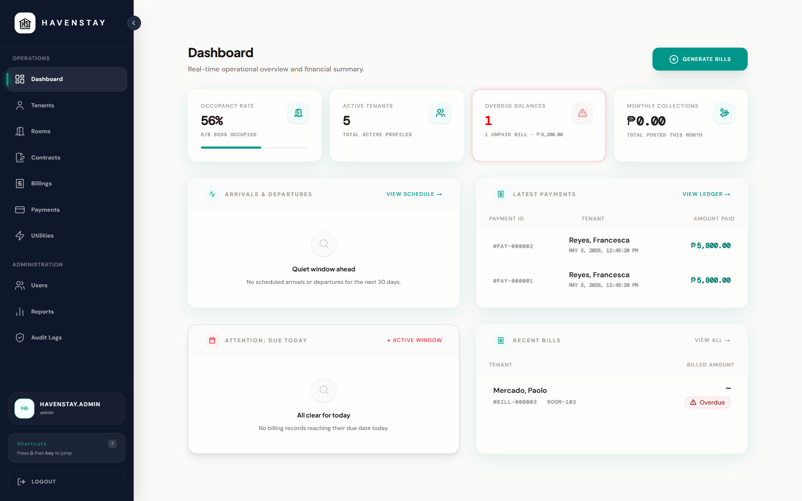

<div align="center">

# 🏢 HavenStay BHMS
### Enterprise-Grade Boarding House & Bed-Level Property Management System

An end-to-end property management and forensic auditing platform engineered for granular bed-level occupancy tracking, contract lifecycles, and metered utility billing with a zero-trust database audit engine.

[-FF2D20?style=for-the-badge&logo=laravel&logoColor=white)](https://laravel.com)
[-000000?style=for-the-badge&logo=next.js&logoColor=white)](https://nextjs.org)
[](https://www.mysql.com/)
[](https://tailwindcss.com)
[](https://www.docker.com/)
[](docs/DATABASE.md)
[](LICENSE)

<br/>



</div>

---

## 📌 Executive Summary & Problem Solved

Traditional property management systems operate on whole-unit or apartment-level abstractions, failing to model shared living spaces such as boarding houses, student dormitories, and co-living hubs. 

**HavenStay** solves the operational, billing, and integrity challenges inherent in multi-tenant shared residences:
1. **Bed-Level Allocation**: Manages granular individual bed spaces within shared rooms with atomic reservation and occupancy states.
2. **Metered Utility Rollover Engine**: Handles shared and sub-metered water and electricity billing, prorating consumption across occupants with automated meter rollover calculation.
3. **Trigger-Based Forensic Auditing**: Mitigates administrative fraud and maintains compliance through an immutable database trigger layer capturing before-and-after JSON state diffs independently of application code.

---

## ⚡ Core Engineering Highlights

```
┌────────────────────────────────────────────────────────────────────────┐
│                          HavenStay Architecture                        │
│                                                                        │
│   Next.js 16 Client (React 19, Tailwind v4, Optimistic UI, RBAC)       │
│                                  │ (REST + Idempotency Tokens)         │
│                                  ▼                                     │
│   Laravel 13 API Core (PHP 8.4+, Service Layer, Form Requests)         │
│               │                                          │             │
│      (Writes & Mutations)                       (Read Queries/Reports) │
│               ▼                                          ▼             │
│   MySQL 8.4 Primary Instance                    MySQL 8.4 Read Replica │
│       │                                                  ▲             │
│       ├── 45 DB Triggers (Row Diffs) ──────────────┐     │ Replication │
│       ▼                                            ▼     │             │
│   Operational Tables (Rooms/Beds/Bills) ──► audit_logs ──┴─────────────┘
└────────────────────────────────────────────────────────────────────────┘
```

### 1. 🛡️ 45-Trigger Zero-Trust Forensic Audit Layer
- **Engine-Level Change Tracking**: Rather than relying strictly on application-level middleware (which can be bypassed by direct queries or scripts), HavenStay implements **45 MySQL database triggers** across all operational tables.
- **Immutable JSON Diffs**: Captures actor ID, IP address, timestamp, action (`INSERT`, `UPDATE`, `DELETE`), and complete `before`/`after` snapshots.
- **Visual Audit Explorer**: An integrated administrative diff modal renders granular attribute-level changes with humanized visual indicators.

### 2. 🛏️ Finite State Bed-Level Occupancy Machine
- Hierarchical partitioning: `Room` $\rightarrow$ `BedSpace` $\rightarrow$ `Contract` $\rightarrow$ `Tenant`.
- Manages state transitions (`Available`, `Reserved`, `Occupied`, `Maintenance`, `Archived`) with strict invariant guards preventing double-booking and invalid lease state transitions.

### 3. ⚡ Metered Utility Apportionment & Rollover Protection
- Multi-occupant sub-metering algorithm calculating consumption across shared rooms.
- **Dial Rollover Handling**: Corrects for mechanical and digital meter overflows (e.g. rollbacks from `99999` to `00001`) preventing anomalous billing spikes.
- Automated invoice line-item generation factoring in tiered municipal rates and base rental fees.

### 4. 🔀 Primary-Replica Read/Write Database Splitting
- Optimized for analytical reporting workloads (`ActiveContracts`, `BillingSummary`, `CollectionsPerformance`).
- Read-heavy queries and export jobs are isolated to replica nodes to eliminate lock contention on primary transactional tables.

### 5. 🔒 Comprehensive RBAC & Idempotency Protection
- Strict Role-Based Access Control (`Admin`, `Staff`, `Viewer`) enforced across route gates, controller policies, and UI actions.
- Dual authentication support: **Google OAuth 2.0** and **Sanctum session-based tokens**.
- Idempotency key middleware prevents duplicate financial transactions and duplicate contract commits under flaky network conditions.

### 6. 🧪 Architectural Invariant & Quality Convention Tests
- Automated Pest & PHPUnit architectural tests (`BillingPaymentArchitectureConventionTest`, `ControllerAuthorizationConsistencyTest`, `ReportingSecurityConventionTest`) continuously enforce authorization uniformity and layer boundaries.

---

## 🏛️ System Architecture & Design

<div align="center">
  
</div>

---

## 🛠️ Technology Stack

| Layer | Technologies | Key Responsibilities |
| :--- | :--- | :--- |
| **Frontend** | **Next.js 16** (App Router), **React 19**, **Tailwind CSS v4** | Server components, optimistic state UI, responsive tables, audit diff visualization |
| **Backend API** | **Laravel 13**, **PHP 8.4+ / 8.5** | RESTful endpoints, service architecture, policy gates, form request validation |
| **Database** | **MySQL 8.4** (Primary-Replica Topology) | ACID transactions, read/write splitting, 45 forensic triggers, stored views |
| **Authentication** | **Laravel Sanctum**, **Google OAuth 2.0** | Secure bearer token management, social login, session validation |
| **DevOps & Infra** | **Docker Compose**, **GitHub Actions**, **Makefile** | Multi-container orchestration, automated CI linting & test suites, zero-drift builds |
| **Cloud Deployment** | **Render** (API) + **Vercel** (UI) + **Aiven** (MySQL) | Highly available decoupled cloud deployment topology |

---

## 🚀 Quick Start (Docker Environment)

### Prerequisites
- [Docker Engine](https://docs.docker.com/engine/install/) & [Docker Compose](https://docs.docker.com/compose/)
- `make` utility (optional, for convenience shortcuts)

### 1. Clone & Setup Environment
```bash
git clone https://github.com/markalvincadangin/havenstay.git
cd havenstay
make env-docker
```

### 2. Build & Launch Containers
```bash
make build
make up
```

### 3. Initialize & Seed Database
```bash
make refresh
```

### 4. Access Local Services
- **Web Application**: [http://localhost:3000](http://localhost:3000)
- **API Health Check**: [http://localhost:8000/api/health](http://localhost:8000/api/health)

---

## 👥 Seeded Demo Accounts

The database seeder provisions pre-configured role accounts for immediate testing:

| Role | Email | Password | Access Scope |
| :--- | :--- | :--- | :--- |
| **Admin** | `havenstay.admin@havenstay.com` | `HavenStay123!` | Full administrative control, system settings, user provisioning, raw audit trail |
| **Staff** | `havenstay.staff@havenstay.com` | `HavenStay123!` | Room allocation, tenant check-in/out, utility billing, payment processing |
| **Viewer** | `viewer@havenstay.com` | `HavenStay123!` | Read-only analytics, occupancy reports, and read-replica dashboards |

---

## 📚 Technical Documentation Hub

Comprehensive engineering and architectural specifications are maintained in [`docs/`](docs/):

### Specifications & System Design
- [**SRS (Software Requirements Specification)**](docs/SRS.md) — Functional and non-functional requirements matrix
- [**SDD (Software Design Document)**](docs/SDD.md) — Architectural patterns, sequence flows, and component design
- [**Database & Trigger Schema**](docs/DATABASE.md) — Complete ERD, trigger definitions, and stored views
- [**Business Rules Specification**](docs/BUSINESS_RULES.md) — Canonical rules governing billing, contracts, and penalties

### Developer & Operational Blueprints
- [**API Reference Guide**](docs/API_REFERENCE.md) — Complete endpoint catalog with request/response contracts
- [**Frontend Coding Blueprint**](docs/FRONTEND_CODING_BLUEPRINT.md) — Next.js conventions, UI design system, and state rules
- [**Backend Coding Blueprint**](docs/BACKEND_CODING_BLUEPRINT.md) — Service patterns, strict typing, and layer standards
- [**Operations Runbook**](docs/OPERATIONS_RUNBOOK.md) — Maintenance procedures, cron cycles, and temporal logic
- [**CI/CD Pipeline Guide**](docs/CI_CD.md) — GitHub Actions workflows and deployment pipelines

---

## 👨‍💻 Author & Contact

**Mark Alvin Cadangin**
* **GitHub**: [@markalvincadangin](https://github.com/markalvincadangin)
* **Project Repository**: [https://github.com/markalvincadangin/havenstay](https://github.com/markalvincadangin/havenstay)

---

## 📄 Portfolio License & Terms of Use

This repository is a personal portfolio piece developed by **Mark Alvin Cadangin**. 

**All Rights Reserved.** The source code, database architecture, design assets, and documentation are made publicly available exclusively for **evaluation, review, and demonstration purposes**. No permission is granted to reproduce, distribute, deploy, sublicense, or utilize any part of this software commercially or privately without prior written consent from the author. See [LICENSE](LICENSE) for details.
