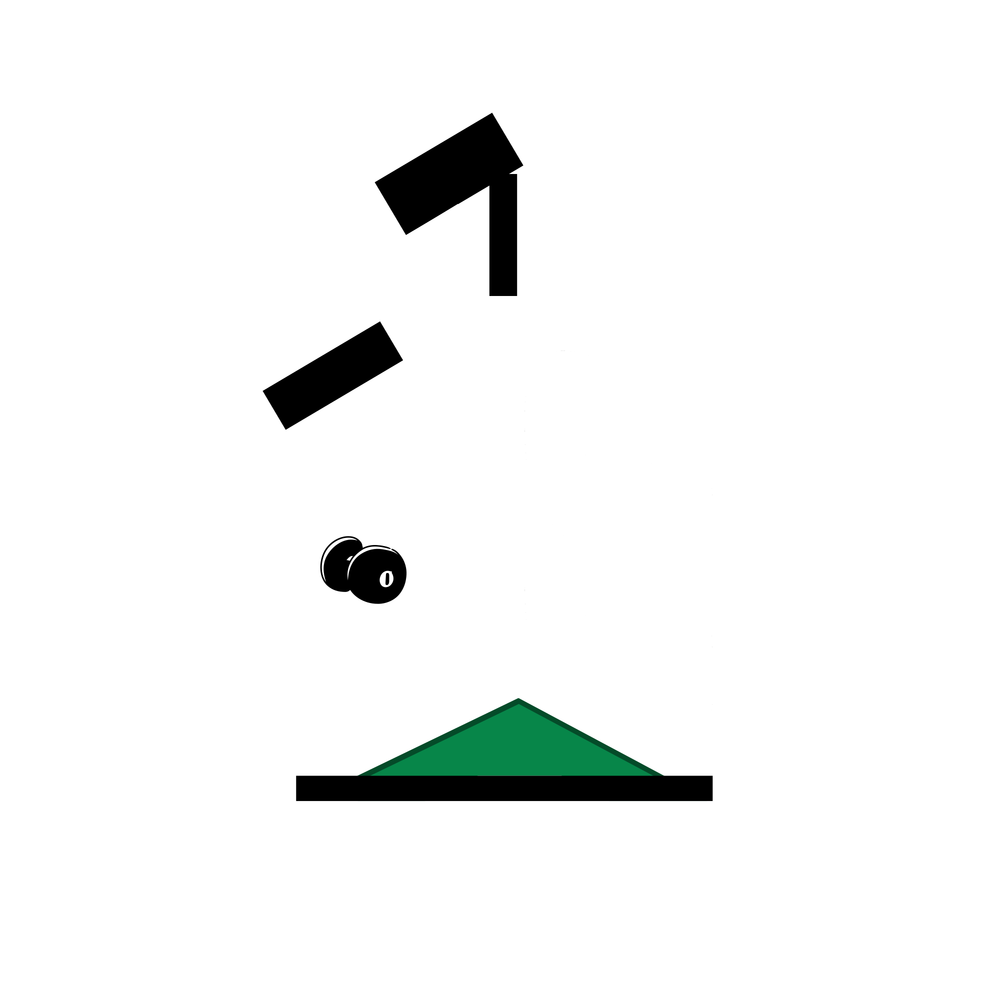

<div align="center">

<picture>
  <source media="(prefers-color-scheme: dark)" srcset="frontend/public/brand/logo-dark.svg">
  <source media="(prefers-color-scheme: light)" srcset="frontend/public/brand/logo-light.svg">
  
</picture>

### Multi-Tenant Student Housing & Bed-Level Property Management System
**Full-Stack Coursework Capstone (CC 206) · Information Management · West Visayas State University**

*Designed for student boarding houses and dormitories in Iloilo City with bed vacancy tracking, utility sub-metering, and database-level audit logs.*

[](backend/)
[](frontend/)
[-4479A1?style=flat-square&logo=mysql&logoColor=white)](docs/DATABASE.md)
[](frontend/)
[](docker-compose.yml)
[](docs/DATABASE.md)
[](frontend/)
[](LICENSE)
[](https://markcadangin.me/projects/havenstay)
[](https://havenstay-theta.vercel.app)

<br/>

<a href="#about-the-project">Overview</a> •
<a href="#system-architecture">Architecture</a> •
<a href="#key-features">Key Features</a> •
<a href="#technology-stack">Tech Stack</a> •
<a href="#quick-start-docker-environment">Quick Start</a> •
<a href="#seeded-demo-accounts">Demo Accounts</a> •
<a href="#why-i-built-it-this-way">Design Rationale</a> •
<a href="https://markcadangin.me/projects/havenstay">Live Case Study</a>

<br/><br/>


</div>

---

## About the Project

Near universities like West Visayas State University (WVSU), most student accommodations are not standalone apartments or single-family houses. They are boarding houses where multiple students share rooms and rent individual bed spaces.

Standard property management tools assume one lease per house or apartment unit. This breaks down in boarding house setups because:
1. **Vacancies happen per bed, not per room**: A 4-person room might have 1 bed available and 3 occupied. Landlords need to track individual bed-space availability and rent contracts without treating the entire room as vacant or occupied.
2. **Shared utility sub-metering**: Electricity and water are frequently split among roommates or measured using mechanical sub-meters. Monthly billing requires prorating shared usage and handling dial rollovers (when a mechanical meter ticks over from 99999 to 00001).
3. **Disputed payment records**: Verbal agreements and manual paper notes between students and landlords often cause disputes about payments, security deposits, or room reassignments.

I developed **HavenStay** as a solo coursework project for **Information Management** at West Visayas State University (WVSU) to build a database-driven full-stack system specifically modeled for these multi-tenant student housing workflows.

**Project status:** Coursework prototype (Information Management) with a containerized Docker Compose environment and a deployed live demonstration.  
**Live Demo:** [havenstay-theta.vercel.app](https://havenstay-theta.vercel.app)

---

## System Architecture

```
┌────────────────────────────────────────────────────────────────────────┐
│                          HavenStay Architecture                        │
│                                                                        │
│   Next.js 16 Client (React 19, Tailwind CSS v4, Server Components)     │
│                                  │ (REST API / Bearer Token)           │
│                                  ▼                                     │
│   Laravel 13 API Core (PHP 8.4+, Service Layer, Policies, Form Requests)│
│               │                                          │             │
│      (Writes & Mutations)                       (Read Queries/Reports) │
│               ▼                                          ▼             │
│   MySQL 8.4 Primary Instance                    MySQL 8.4 Read Replica │
│       │                                                  ▲             │
│       ├── 45 DB Triggers (Row Diffs) ──────────────┐     │ Replication │
│       ▼                                            ▼     │             │
│   Operational Tables (Rooms/Beds/Bills) ──► audit_logs ──┴─────────────┘
└────────────────────────────────────────────────────────────────────────┘
```

---

## Key Features

### 1. Bed-Level Inventory & Lease Contracts
- Hierarchical structure: `Property` → `Room` → `Bed Space` → `Lease Contract` → `Tenant`.
- Tracks individual bed space statuses (`Vacant`, `Occupied`, `Maintenance`) to prevent double-booking while rooms remain partially occupied.
- Manages security deposits, contract durations, payment due dates, and tenant move-outs.

### 2. 45 Database Triggers for Change Auditing
- Implemented **45 MySQL database triggers** (`AFTER INSERT`, `AFTER UPDATE`, `AFTER DELETE`) across all operational tables.
- Each trigger automatically captures the record ID, timestamp, action, and full before/after JSON diffs into an `audit_logs` table.
- Because audit tracking lives in the database storage engine, every mutation is recorded even if data is updated through database migrations, raw SQL queries, or administrative artisan scripts.
- An in-app audit explorer renders structured attribute-level diffs so staff can see who modified a record and what fields changed.

### 3. Sub-Metered Utility Billing & Dial Rollover Calculation
- Supports room-level sub-meter inputs for water and electricity.
- Prorates shared consumption across active occupants in each room during the billing period.
- **Dial rollover handling**: Detects when mechanical sub-meters roll over (e.g. from 99999 back to 00001) to prevent erroneous billing spikes.

### 4. Primary-Replica Database Topology
- Configured with a **MySQL 8.4 primary-replica setup** via Docker Compose.
- Write operations (tenant check-in, contract signing, payments) execute against the primary database instance.
- Analytical reporting queries (occupancy metrics, revenue summaries, collection histories) are routed to the read replica to avoid locking transactional tables during heavy reads.

### 5. Role-Based Access Control & Invariant Testing
- Built with three user roles (`Admin`, `Staff`, `Viewer`) with route guards, Laravel policies, and UI permission gates.
- Automated Pest & PHPUnit convention tests enforce authorization consistency and verify that architectural boundaries between controllers and services remain intact.

---

## Architecture Diagram

<div align="center">
  
</div>

---

## Technology Stack

| Layer | Technologies | Role in System |
| :--- | :--- | :--- |
| **Frontend** | **Next.js 16**, **React 19**, **Tailwind CSS v4** | App Router, Server Components, responsive data tables, audit diff modal |
| **Backend API** | **Laravel 13**, **PHP 8.4+** | RESTful API, service layer, authorization policies, form request validation |
| **Database** | **MySQL 8.4** (Primary-Replica Topology) | ACID transactions, read/write splitting, 45 database triggers, JSON diffs |
| **Authentication** | **Laravel Sanctum**, **Google OAuth 2.0** | Token-based API authentication and social login |
| **DevOps & Infra** | **Docker Compose**, **GitHub Actions**, **Makefile** | Multi-container local orchestration, automated CI test suites |

---

## Quick Start (Docker Environment)

### Prerequisites
- [Docker Engine](https://docs.docker.com/engine/install/) (v24+) & [Docker Compose v2](https://docs.docker.com/compose/)
- `make` utility (or bash shell on Linux / macOS / WSL2)

### Automated Setup
```bash
# 1. Clone the repository
git clone https://github.com/markalvincadangin/havenstay.git
cd havenstay

# 2. Run automated setup (generates .env, builds images, starts containers, runs migrations)
./scripts/setup.sh
# (or use Makefile: make setup && make up)

# 3. Verify endpoints and database replication
make smoke-test
```

### Local Services

| Service | Address | Default Credentials | Description |
| :--- | :--- | :--- | :--- |
| **Frontend Web App** | [http://localhost:3000](http://localhost:3000) | *(See Seeded Accounts below)* | Next.js 16 interface with bed management and audit viewer |
| **Backend API** | [http://localhost:8000/api/health](http://localhost:8000/api/health) | N/A | Laravel 13 REST API |
| **MySQL Primary** | `localhost:3306` | User: `root` / Pass: `changeme_root_password` | Master transactional database node (45 triggers) |
| **MySQL Read Replica** | `localhost:3307` | User: `root` / Pass: `changeme_root_password` | Read-only analytics node with GTID replication |

---

## Seeded Demo Accounts

The database seeder provisions accounts for testing role-based permissions:

| Role | Email | Password | Access Scope |
| :--- | :--- | :--- | :--- |
| **Admin** | `havenstay.admin@havenstay.com` | `HavenStay123!` | System settings, user management, full operational control, raw audit logs |
| **Staff** | `havenstay.staff@havenstay.com` | `HavenStay123!` | Room and bed allocation, tenant intake, utility billing, payment entry |
| **Viewer** | `viewer@havenstay.com` | `HavenStay123!` | Read-only access to occupancy dashboards and analytical reports |

---

## Automated Tests & Verification

```bash
# Run both backend and frontend test suites in containers
make test

# Run backend unit & feature tests (Pest / PHPUnit)
make test-backend

# Run frontend test suite (Vitest + Testing Library)
make test-frontend

# Run code style and static analysis (PHPStan + ESLint)
make lint
```

---

## Why I Built It This Way

- **Why database triggers instead of Laravel Model Observers?**  
  In Laravel applications, Model Observers only fire when mutations pass through the Eloquent ORM. If anyone runs a direct SQL query, an administrative `artisan` script, or a raw bulk update, observers never trigger. Placing 45 triggers directly inside MySQL ensures that every row insertion, update, or deletion captures before-and-after snapshots regardless of how the database is touched.

- **Why primary-replica replication for a boarding house system?**  
  While a single boarding house does not generate petabytes of data, multi-tenant student dorms generate frequent reporting queries (e.g. historical billing reconciliation, occupancy trends, tenant ledger summaries). Running replication in Docker Compose gave me hands-on experience structuring read/write splitting at the application and infrastructure layer.

- **Why bed-level tracking instead of room-level?**  
  A student boarding house sells bed spaces, not rooms. If a system only models rooms, landlords have to use awkward workarounds like creating "Room 101-A", "Room 101-B" as separate rooms in the database. Modeling `BedSpace` as a first-class entity under `Room` directly matches how the real-world facility operates.

---

## Documentation Index

Detailed design documents are maintained in [`docs/`](docs/):
- [**Database & Trigger Schema**](docs/DATABASE.md) — ERD diagrams, 45 trigger definitions, and stored views
- [**SRS (Requirements Specification)**](docs/SRS.md) — Functional and non-functional requirements
- [**SDD (System Design Document)**](docs/SDD.md) — Architectural patterns and data flow sequences
- [**Business Rules Specification**](docs/BUSINESS_RULES.md) — Utility billing calculations, contract terms, and penalties
- [**Deployment Runbook**](docs/DEPLOYMENT.md) — Containerized deployment guide

---

## Author & Attribution

Developed and architected by **[Mark Alvin Cadangin](https://markcadangin.me)**  
3rd-Year BSIT Student majoring in Software Development Technologies at West Visayas State University  
DOST-SEI Scholar (Batch 2024) · Western Visayas, Philippines  
Portfolio: [markcadangin.me](https://markcadangin.me) · Email: [markcadangin@gmail.com](mailto:markcadangin@gmail.com)  
Coursework: Information Management (CC 206) · WVSU CICT

---

## License

This repository is a personal coursework project made available for portfolio evaluation and demonstration purposes. See [LICENSE](LICENSE) for details.
