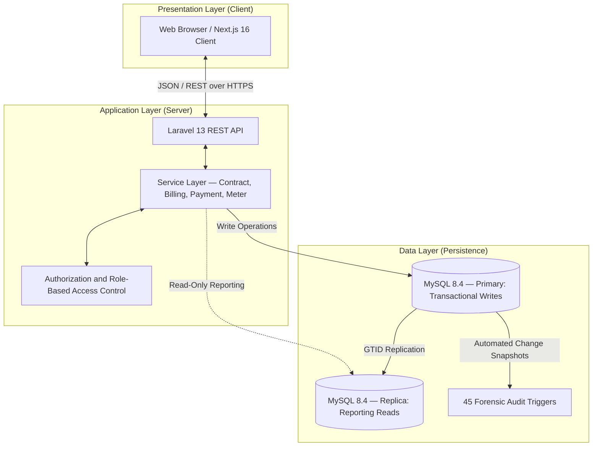
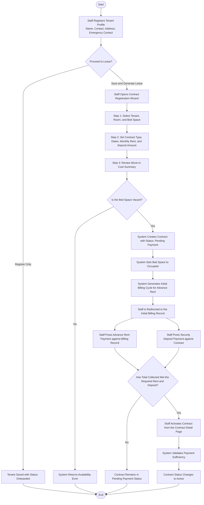
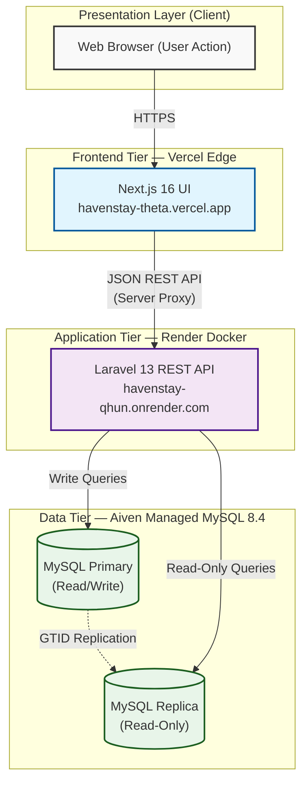
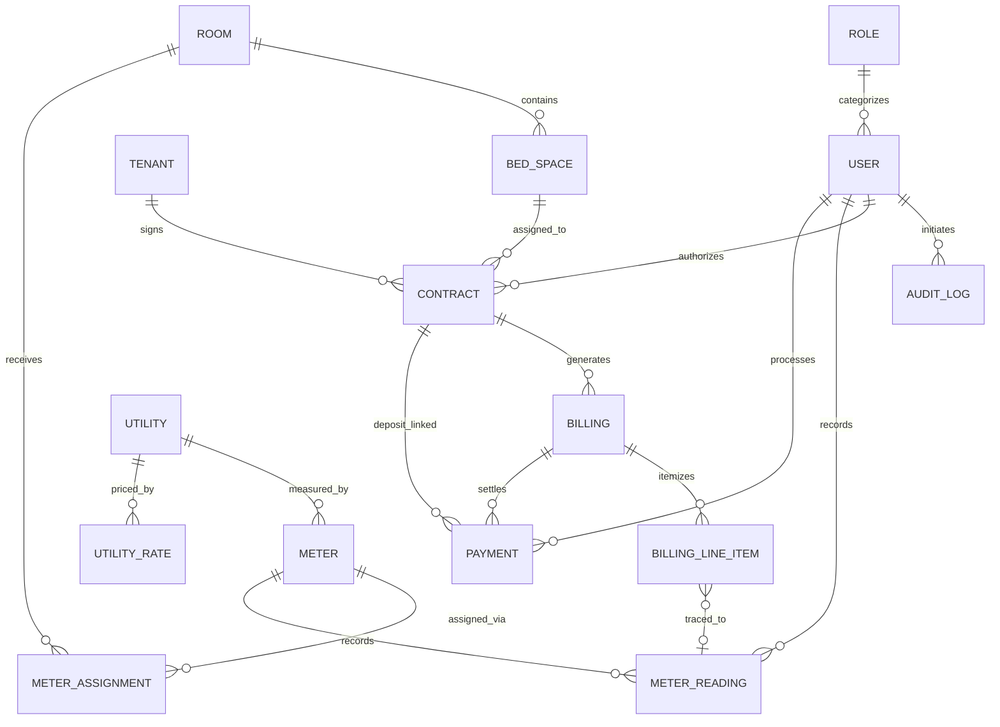

# **HavenStay Boarding House Management System**

## **System Documentation**

---

## **1. Introduction**

### **1.1 Background of the Project**

Boarding house management in small to medium residential operations is traditionally handled through manual processes—handwritten ledgers, paper receipts, verbal agreements, and isolated spreadsheets. These methods are adequate in very small settings but become increasingly unreliable as tenant volume grows. Records are prone to loss, calculations are susceptible to human error, and there is no reliable mechanism for tracing who made a change, when it was made, or why.

The HavenStay Boarding House Management System was developed to address these operational gaps. The system was designed from the ground up to digitize and automate the core workflows of a boarding house—tenant registration, room assignment, billing generation, utility metering, and payment collection—under a single, centralized, and accountable platform.

---

### **1.2 Purpose of the System**

The purpose of HavenStay is to provide property owners and administrative staff with a reliable, web-based platform for managing all aspects of boarding house operations. The system eliminates the dependency on manual record-keeping by automating routine tasks such as monthly billing, utility charge computation, and contract lifecycle management.

Beyond operational automation, HavenStay is purpose-built for accountability. Every data modification in the system—whether a record is created, updated, or deleted—is automatically captured by the database and stored in an immutable audit log. This ensures that the system maintains a verifiable, non-repudiable history of all actions taken at any point in time.

---

### **1.3 Problem Statement**

The following problems were identified in traditional boarding house management practices and directly informed the design of this system:

* **Manual tenant tracking** — Room availability and occupant histories were maintained informally, making it difficult to determine vacancy status at a given point in time.
* **Billing and payment errors** — Utility charges, particularly for shared rooms, were computed manually and inconsistently. Partial payments were rarely tracked with precision.
* **Absence of an audit trail** — No record existed of who modified a data entry, when it was changed, or what the previous value was. This left disputes unresolvable.
* **No centralized data system** — Tenant records, payment histories, and room details were stored across separate files with no relational integrity.
* **Inefficient reporting** — Generating occupancy summaries or collection reports required manual consolidation from multiple sources, which was both time-consuming and error-prone.

---

### **1.4 System Overview**

HavenStay is a web-based application built on a three-tier architecture. Administrative users access the system through a browser interface, which communicates with a server-side application layer responsible for enforcing business rules and processing requests. All data is persisted in a relational database that enforces referential integrity and captures change history automatically.

The system supports three user roles—Administrator, Staff, and Viewer—each with a defined scope of access. Administrators have full control over the system, including user management and audit log inspection. Staff members handle day-to-day operations such as tenant registration, billing, and payment recording. Viewers are granted read-only access for directory and reporting purposes.

The workflow begins when a tenant is registered and assigned to a specific bed space within a room. A formal rental contract is then created, which serves as the anchor for all billing and payment activity. Monthly billing cycles are generated against active contracts, and payments are recorded against those cycles. Utility consumption is tracked through physical meter readings and automatically apportioned among roommates. All of these operations are logged at the database level without any additional action required from the user.

---

## **2. Objectives**

### **2.1 General Objective**

To develop a web-based Boarding House Management System that automates and centralizes tenant, room, billing, and payment operations while maintaining a complete and tamper-proof record of all system activity.

---

### **2.2 Specific Objectives**

* To manage tenant records digitally, including profile information, contract history, and occupancy status
* To automate the generation of monthly billing cycles and the computation of utility charges on a per-tenant basis
* To track payment transactions across multiple categories, including rent, deposits, and refunds
* To implement a bed-level room inventory system with defined status transitions for vacancy, occupancy, and maintenance
* To enforce role-based access control so that system functions are accessible only to authorized personnel
* To implement automatic audit logging that captures every data change at the database level with actor attribution and request context
* To provide administrative reports for occupancy monitoring, financial collections, and contract history

---

## **3. Scope and Delimitations**

### **3.1 Scope**

The HavenStay system covers the following functional areas:

* **Tenant Management** — Registration, profile maintenance, status tracking (onboarded, active, moved out, archived), and contract history viewing
* **Room and Bed Inventory** — Room creation with type classification (private or shared), bed space management, and status tracking (vacant, occupied, under maintenance, decommissioned)
* **Contract Management** — Lease creation, lifecycle transitions (pending payment → active → completed or terminated), voiding for erroneous entries, and contiguous renewal support
* **Utility and Metering** — Physical meter registration, meter-to-room assignments, consumption reading records, and temporal rate management
* **Billing and Payments** — Monthly billing cycle generation with itemized line items, multi-method payment recording, void support, and deposit/refund management
* **User Account Management** — User provisioning, role assignment, activation, deactivation, and archival
* **Forensic Audit Logging** — Immutable, trigger-based logging of all insert, update, and delete operations across core tables
* **Reporting and Analytics** — Occupancy reports, billing summaries, outstanding balances, collections performance, and tenant ledgers, accessible to Administrators

---

### **3.2 Delimitations**

* The system is web-based only. No native mobile application is included in the current release.
* Payment recording is manual. The system does not integrate directly with third-party payment gateways such as GCash or PayMaya.
* The system is designed for a single boarding house property. Multi-branch or franchise-level hierarchy is not supported in the current version.
* No AI-based features are included. Predictive occupancy forecasting and automated maintenance scheduling are outside the present scope.
* Tenant self-service access is not provided. All operations are performed by administrative staff through the management interface.

---

## **4. System Architecture and Design**

### **4.1 System Architecture Diagram**

HavenStay follows a decoupled three-tier architecture. The presentation layer, application layer, and data layer each have a clearly defined responsibility, which allows the system to be maintained and scaled independently at each tier.

*Figure 1: HavenStay Three-Tier System Architecture*

**Description:**
The browser communicates with the Laravel REST API over HTTPS using JSON. The API delegates all business logic to the service layer, which enforces role-based rules before performing any database operation. All write operations are directed to the primary MySQL instance, while read-only reporting queries are routed to a replica to reduce load on the transactional database. The 45 forensic triggers fire automatically on the primary instance whenever a record is inserted, updated, or deleted, writing a corresponding entry to the audit log without any involvement from the application layer.

---

### **4.2 Activity Diagram**

The following diagram illustrates the complete tenant onboarding workflow as implemented across the system, from initial registration through contract activation.

*Figure 2: Activity Diagram — Tenant Onboarding and Contract Activation Workflow*

**Description:**
The onboarding process begins with tenant registration, which collects personal and emergency contact information through a three-step form. At the final step, staff may choose to register the tenant profile only, or proceed directly to lease registration using the "Save and Generate Lease" shortcut. The contract wizard handles room and bed space selection as a separate step from tenant registration. Upon contract submission, the system simultaneously creates the contract in a Pending Payment status, locks the bed space as occupied, and generates the first billing cycle for advance rent. The security deposit is posted separately as a standalone payment transaction linked directly to the contract record, while the advance rent payment is posted against the billing cycle. These are two distinct payment entries in the system, as the database enforces an exclusive linkage rule—a payment must target either a billing record or a contract, never both. Contract activation is triggered manually by staff on the contract detail page, and only succeeds once the system confirms that the total amount collected meets or exceeds the combined rent and deposit requirement.

---

### **4.3 Deployment Diagram**

The system is deployed across three managed cloud platforms, each handling a distinct tier of the application. All services used in the test deployment operate on free-tier plans.

*Figure 3: HavenStay Live Deployment Diagram — Vercel, Render, and Aiven*

**Description:**
The browser communicates with the Next.js application hosted on Vercel's global edge network over HTTPS. API requests from the frontend are transparently rewritten by Vercel's server-side proxy to the Laravel backend running on Render as a Dockerized web service. The Laravel API connects to the Aiven-managed MySQL instance over an encrypted SSL/TLS connection on port 3306. In the free-tier test deployment, a single MySQL instance handles all read and write queries. All three platforms auto-deploy from the main branch on GitHub, so any code push triggers a rebuild on both Render and Vercel without manual intervention.

---

## **5. Database Design**

### **5.1 Database Overview**

HavenStay uses a MySQL relational database normalized to the Third Normal Form (3NF). The schema is structured to ensure that all financial values, occupancy statuses, and audit records are derived from a single authoritative source, eliminating redundancy and preventing update anomalies.

The database consists of **15 core tables**, **6 reporting views**, and **45 forensic audit triggers**.

Key design principles applied to the schema:

* **Referential Integrity** — Foreign key constraints and soft-delete patterns ensure that historical records are preserved even when entities are retired from active use.
* **Trigger-Based Forensic Logging** — All 45 triggers fire automatically after data modifications and write before-and-after snapshots to the `audit_logs` table. The audit log is protected by two additional triggers that prevent any modification or deletion of its records.
* **Derived Financial Totals** — Billing totals are never stored. They are computed dynamically from the `billing_line_items` and `payments` tables to prevent calculation drift.
* **Reporting Views** — Six database views (`vw_*`) encapsulate complex multi-table joins, ensuring that reporting logic is consistent regardless of which interface queries the data.

---

### **5.2 Entity-Relationship Diagram (ERD)**

The **Contract** entity is the central anchor of the data model. It binds a Tenant to a specific Bed Space and serves as the parent record for all billing and payment activity.

*Figure 4: Entity-Relationship Diagram — HavenStay Database*

---

### **5.3 Table Structure Summary**

The following table provides a summary of the 15 database tables in the HavenStay schema.

| Table Name | Primary Key | Purpose |
| :--- | :--- | :--- |
| `roles` | `role_id` | Defines system access roles (Admin, Staff, Viewer) |
| `users` | `user_id` | Stores authenticated user accounts with soft-delete support |
| `tenants` | `tenant_id` | Stores tenant profile records and occupancy status |
| `rooms` | `room_id` | Stores room inventory, type classification, and base pricing |
| `bed_spaces` | `bed_space_id` | Tracks individual bed occupancy within each room |
| `contracts` | `contract_id` | Records rental agreements linking tenants to specific bed spaces |
| `utilities` | `utility_id` | Defines billable utility services (e.g., Electricity, Water) |
| `meters` | `meter_id` | Registers physical utility measurement devices |
| `meter_assignments` | `assignment_id` | Records the mapping of a meter to a room with an effective date |
| `meter_readings` | `reading_id` | Stores point-in-time consumption values recorded by staff |
| `utility_rates` | `rate_id` | Maintains temporal unit pricing per utility type |
| `billing` | `billing_id` | Stores monthly billing cycle headers per contract |
| `billing_line_items` | `line_item_id` | Stores itemized charges within each billing cycle |
| `payments` | `payment_id` | Records financial transactions for billing settlements and deposits |
| `audit_logs` | `id` | Immutable forensic log of all data changes across all core tables |

---

## **6. System Screenshots and Functionalities**

### **6.1 Login Page**

*(Insert screenshot — Figure 5)*

**Description:** The login page serves as the authenticated entry point to the system. Users provide their credentials, which are validated against hashed records in the database using Laravel Sanctum. Upon successful authentication, the system resolves the user's role and applies the appropriate access scope. Failed login attempts are recorded in the audit log for security monitoring purposes.

---

### **6.2 Dashboard**

*(Insert screenshot — Figure 6)*

**Description:** The dashboard presents a real-time operational summary tailored to the user's role. Administrators view system-wide financial and occupancy KPIs, including total active tenants, current occupancy rate, monthly collections, and overdue balances. Staff members are shown a task-oriented view highlighting upcoming move-outs and pending billing cycles. Viewer accounts are directed to a read-only directory view.

---

### **6.3 Tenant Management**

*(Insert screenshot — Figure 7)*

**Description:** The tenant management module provides a searchable directory of all registered tenants and their current status. Staff can register new tenants, update contact information, and view the full contract and payment history for each profile. Tenant status transitions—from onboarded to active to moved out—are maintained automatically by the system based on contract activity. Administrative archival of a tenant is a manual, protected operation.

---

### **6.4 Room and Bed Inventory**

*(Insert screenshot — Figure 8)*

**Description:** The room management module displays the property's full inventory of rooms and bed spaces. Each room is classified as either private (single occupant) or shared (multiple occupants). Room and bed statuses are maintained automatically based on occupancy: a room is marked available when at least one bed is vacant, and unavailable when all beds are occupied or under maintenance. Staff can add new bed spaces to existing rooms and place individual beds under maintenance without affecting other beds in the same room.

---

### **6.5 Billing and Payments**

*(Insert screenshot — Figure 9)*

**Description:** The billing module handles the generation and tracking of monthly billing cycles. Each cycle is linked to a specific contract and consists of itemized line items for base rent, utility charges, penalties, and adjustments. Utility charges for shared rooms are automatically divided equally among all active occupants. Staff record payments against billing cycles, and the system recalculates the outstanding balance immediately after each transaction. Voided payments are retained in the record with a void reason and timestamp but are excluded from all balance computations.

---

### **6.6 Audit Logs**

*(Insert screenshot — Figure 10)*

**Description:** The audit log module provides Administrators with a complete, immutable record of every data change that has occurred in the system. Each entry identifies the table affected, the record changed, the before and after values, the user responsible, the IP address of the request, and a correlation ID that groups all changes produced by a single administrative action. The log cannot be edited or deleted by any user, including the system administrator, as this restriction is enforced at the database trigger level.

---

## **7. Technology Stack**

| Component | Technology | Version |
| :--- | :--- | :--- |
| Frontend Framework | Next.js with App Router | 16.x |
| Frontend Library | React | 19 |
| Frontend Styling | Tailwind CSS with custom utility layer | v4 |
| Backend Framework | Laravel | 13.x |
| Backend Language | PHP | 8.3+ |
| Database Engine | MySQL InnoDB | 8.4 |
| API Authentication | Laravel Sanctum | 4.x |
| Infrastructure | Docker Compose | — |
| Version Control | Git / GitHub | — |
| API Testing | Postman | — |
| Diagram Tooling | Mermaid (Markdown-native) | — |

---

## **8. Conclusion**

### **8.1 Summary**

HavenStay successfully addresses the operational and accountability challenges that are common in manually managed boarding house environments. By centralizing tenant records, automating billing computations, enforcing strict contract lifecycle rules, and maintaining an immutable database-level audit trail, the system provides a reliable and transparent platform for property management. The result is a reduction in administrative overhead, fewer billing disputes, and a clear record of all system activity that can be reviewed at any time.

---

### **8.2 Achievements**

* Implemented a bed-level inventory system that prevents double-occupancy through immediate reservation locking upon contract creation
* Automated the computation and equal apportionment of utility charges across shared room occupants
* Achieved full data traceability through 45 database triggers that capture every record modification with actor attribution, IP address, and request context
* Developed six reporting views that provide consistent and accurate occupancy, financial, and historical data across all administrative roles
* Enforced role-based access control that restricts all system functions to authorized personnel without exception

---

### **8.3 Future Improvements**

* Development of a dedicated mobile application for tenants to view billing statements and payment history
* Integration with local payment gateways such as GCash and PayMaya for direct payment processing
* Implementation of IoT-compatible meter interfaces for automated consumption data synchronization
* Expansion of the architecture to support multi-property or multi-branch deployments under a single administrative account
* Addition of an automated notification system for billing due dates, overdue alerts, and upcoming contract expirations

---

*Developed by Mark Alvin Cadangin*
