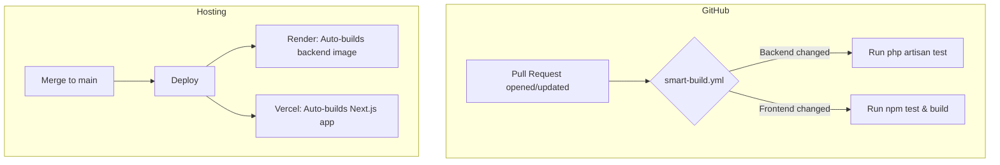

# HavenStay — CI/CD Pipeline

**Version:** 1.0  
**Last Updated:** June 26, 2026

---

## 1. Architecture Overview

HavenStay employs a streamlined CI/CD pipeline tailored for efficiency, avoiding redundant artifact builds while maintaining strict quality gates prior to deployment.

## 2. Continuous Integration (CI)

The CI pipeline runs via GitHub Actions (`.github/workflows/smart-build.yml`) and ensures code stability on every pull request.

### 2.1 Selective Build Execution (Path Filtering)

To minimize unnecessary workflow runs, CI leverages `dorny/paths-filter`.
- **Backend Job**: Runs only if `backend/**`, `docker/**`, `docker-compose.yml`, or the CI workflow itself changes.
- **Frontend Job**: Runs only if `frontend/**` or the CI workflow itself changes.

### 2.2 Test Artifacts Strategy

- **Stdout Focus**: Both `php artisan test` and `npm test` stream results directly to the GitHub Actions console.
- **Why no JUnit XML artifacts?** For this project, CI failing (red) or passing (green) provides the necessary signal. Extracting JUnit XML for artifact storage introduces unnecessary configuration overhead without significantly improving developer velocity.

## 3. Continuous Deployment (CD)

Continuous Deployment is handled natively by our hosting platforms via their deep Git integrations, completely bypassing the need for a custom GitHub Actions CD workflow.

### 3.1 The "Source-Build" CD Strategy

- **Render (Backend):** Configured via `render.yaml` to build the Docker image directly from the `backend/Dockerfile` on every push to `main`.
- **Vercel (Frontend):** Automatically clones and builds the Next.js application from source.

### 3.2 Why We Skip GHCR (GitHub Container Registry)

We deliberately do **not** build and push images to a registry like `ghcr.io` during CI/CD. 
- Because Render builds the backend image from source, and Vercel builds the frontend from source, no environment in our stack pulls pre-built Docker images.
- Implementing a `docker-build.yml` GHCR workflow would consume CI minutes to produce artifacts that are never deployed, constituting anti-pattern over-engineering.

## 4. Secret Management

Secrets are managed within their respective environments rather than centralized in GitHub Actions:

- **GitHub Repository Secrets**: Only requires what is needed for CI operations (none currently needed for the `smart-build` workflow).
- **Render Dashboard**: Hosts backend `.env` variables (`APP_KEY`, `DB_HOST`, `DB_PASSWORD`, etc.).
- **Vercel Dashboard**: Hosts frontend `.env` variables (`BACKEND_INTERNAL_URL`).

---

*Document Author: HavenStay Infrastructure*
