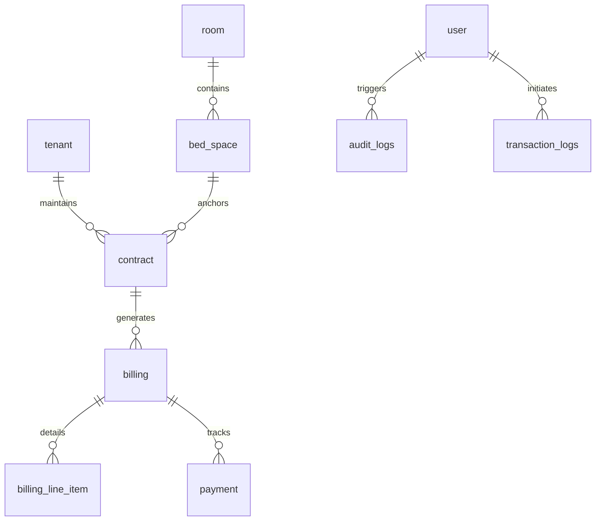

# HavenStay Database Documentation

**Version:** 2.2  
**Last Updated:** April 17, 2026  
**Status:** Canonical schema specification and forensic data design

## 1. Document Boundary
This document is the authoritative specification for the HavenStay data layer. It defines individual entity schemas, relationship constraints, forensic triggers, and reporting views required to support the system capabilities defined in [**SRS.md**](SRS.md). Technical implementation logic is documented in [**SDD.md**](SDD.md).

---

## 2. Distributed Architecture (CCR-002)

The system utilizes a **Primary-Replica** topology to ensure data durability and optimize reporting performance:
- **Primary Node (`db-primary`):** Processes all Data Manipulation Language (DML) operations (INSERT, UPDATE, DELETE). This node is the authoritative host for all 24 forensic triggers.
- **Replica Node (`db-replica`):** A read‑only instance synchronized via GTID‑based asynchronous replication. It handles all reporting queries and dashboard aggregations (`vw_*` views).
- **Service Routing:** Laravel's database configuration automatically splits "read" and "write" connections based on the operational context.

---

## 3. Schema Authority and State

The system maintains a strict **Canonical Schema** to ensure environment parity:
- **Authority:** `db/havenstay_schema.sql` (InnoDB DDL / MySQL 8.4+).
- **Runtime:** `backend/database/sql/havenstay_schema.sql` (Used for deployment/CI).
- **Forensic Engine:** The MySQL engine is utilized for high‑fidelity auditing (Triggers). 
- **Migration Strategy:** The development environment uses SQLite for rapid testing, but all CCR‑008 compliance validation is conducted on MySQL.

---

## 4. Entity Architecture

The database consists of **11 Normalized Tables** utilizing the InnoDB engine for full ACID compliance.

### 4.1 Master and Operational Tables
| Table | Application Purpose | Integrity Pattern |
| :--- | :--- | :--- |
| `roles` | RBAC Role Definitions | Reference |
| `users` | Operator Accounts | Soft Delete |
| `tenants` | Boarding House Residents | Soft Delete |
| `rooms` | Room Inventory and Pricing | Soft Delete |
| `bed_spaces` | Individual Occupancy Units | Referential Lock |
| `contracts` | Rental Agreements | Soft Delete |
| `billing` | Monthly Cycle Headers | Immutable |
| `billing_line_items`| Itemized Ledger Charges | Immutable |
| `payments` | Financial Transaction Records | Soft Void |
| `audit_logs` | Trigger‑driven DML History | Append-Only |
| `transaction_logs` | Workflow State Tracking | Append-Only |

### 4.2 Monetary Standards (BR-013)
To ensure financial integrity across all operational modules, the following standards are enforced in the schema:
- **Data Type:** `DECIMAL(10,2)` for all currency fields.
- **Precision:** Supports up to ₱99,999,999.99.
- **Engine-Level Constraints:**
    - `chk_payment_amount`: `amount_paid > 0`
    - `chk_line_amount`: `amount <> 0`
    - `chk_bed_rate`: `base_rate >= 0`

### 4.3 Retention and Archiving
- **Soft Deletes:** Master entities (`users`, `tenants`, `rooms`, `contracts`) use a `deleted_at` timestamp. Triggers are configured to capture the `DELETE` event while preserving the row for forensic history.
- **Soft Void:** Payments are never physically deleted or soft-deleted; they are "voided" via `voided_at`. This preserves the transaction's place in the financial history and audit trail.

## 5. Forensic Engineering (CCR-007, CCR-008)

The system utilizes two distinct logging mechanisms to ensure a verifiable audit trail of all operational and financial events.

### 5.1 Workflow Transaction Logs (CCR-007)
The `transaction_logs` table records the outcomes of high‑level business workflows. It captures the transition from a "started" state to either a "committed" or "rolled_back" terminal state.

| Status | Triggering Event | Rationale |
| :--- | :--- | :--- |
| **`started`** | Workflow Initiation | Captures intent before data mutation begins. |
| **`committed`** | Successful Completion | Confirmed state change in the database. |
| **`rolled_back`**| System Exception | Transaction reverted via `DB::rollBack()`. |
| **`failed`** | Validation Error | Workflow halted before entering a database transaction. |

### 5.2 Row-Level Audit Triggers (CCR-008)
The MySQL primary node hosts **24 dedicated AFTER triggers** (INSERT, UPDATE, DELETE across 8 tables).
- **Automation:** Triggers automatically capture full JSON snapshots of the `OLD` and `NEW` attributes.
- **Correlation:** Every record is tagged with an `@current_user_id` and a `correlation_id` to link row changes to the initiating workflow.

---

## 6. Analytical Engine (CCR-005)

To maintain reporting consistency and ensure that complex JOINS do not leak into the application logic, the database provides 6 standardized views. All analytical reports query these views exclusively.

| View | Primary Pattern | Business Use Case |
| :--- | :--- | :--- |
| `vw_billing_summary` | 5-Table INNER JOIN | Financial aging and void‑aware balance. |
| `vw_active_contracts` | 4-Table INNER JOIN | Active tenant‑bed mappings. |
| `vw_room_occupancy` | Aggregation / LEFT JOIN | Real‑time vacancy per room. |
| `vw_occupancy_status` | 5-Table LEFT JOIN | Individual bed space vacancy list. |
| `vw_collections_summary` | 6-Table INNER JOIN | Collections performance by period/method. |
| `vw_tenant_contract_history`| 4-Table INNER JOIN | Forensic ledger of all historical contracts. |

## 7. Entity Relationships

---

*Aligned to: SRS.md v4.7 · SDD.md v3.2 · API_REFERENCE.md v2.2 · db/havenstay_schema.sql (canonical)*  
*Last Updated: April 17, 2026 (v2.2 — final audit alignment pass)*
