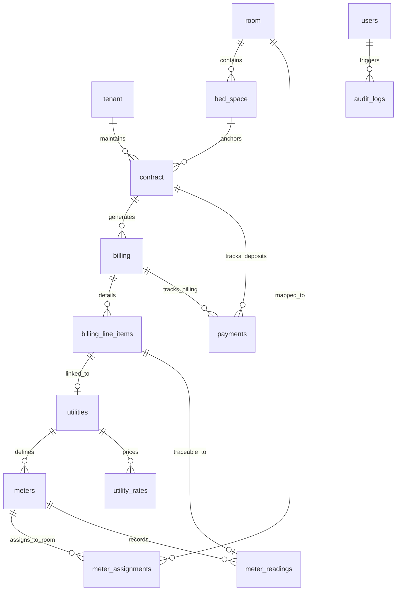

# HavenStay Database Documentation

**Version:** 5.3  
**Last Updated:** April 29, 2026  
**Status:** Canonical integration contract for backend services; forensic alignment baseline (v5.0 engine)

---

## 1. Document Boundary
This document is the authoritative specification for the HavenStay data layer. It defines individual entity schemas, relationship constraints, forensic triggers, and reporting views required to support the system capabilities defined in [**SRS.md**](../docs/SRS.md). Technical implementation logic is documented in [**SDD.md**](../docs/SDD.md).

---

## 2. Distributed Architecture (CCR-002)

The system utilizes a **Primary-Replica** topology to ensure data durability and optimize reporting performance:
- **Primary Node (`db-primary`):** Processes all Data Manipulation Language (DML) operations (INSERT, UPDATE, DELETE). This node is the authoritative host for all 45 forensic triggers.
- **Replica Node (`db-replica`):** A read‑only instance synchronized via GTID‑based asynchronous replication. It handles all reporting queries and dashboard aggregations (`vw_*` views).
- **Service Routing:** Laravel's database configuration automatically splits "read" and "write" connections based on the operational context.

---

## 3. Schema Authority and State

The system maintains a strict **Canonical Schema** to ensure environment parity:
- **Canonical DDL:** `db/havenstay_schema.sql` — primary reference for direct database import (e.g., phpMyAdmin/TablePlus).
- **Deployment Copy:** `backend/database/sql/havenstay_schema.sql` — used for CI/CD and migration equivalence.

> [!IMPORTANT]
> Both files must remain byte-for-byte identical. Any schema change must be applied to both paths.

- **Forensic Engine:** The MySQL engine is utilized for high‑fidelity auditing (Triggers).
- **Migration Strategy:** The development environment uses SQLite for rapid testing, but all **CCR‑007** compliance validation is conducted on MySQL.

---

## 4. Entity Architecture

The database consists of **15 Normalized Tables** (14 operational + 1 forensic) utilizing the InnoDB engine for full ACID compliance.

### 4.1 Master and Operational Tables
| Table | Application Purpose | Integrity Pattern |
| :--- | :--- | :--- |
| `roles` | RBAC Role Definitions | Reference |
| `users` | Operator Accounts | Soft Delete |
| `tenants` | Boarding House Residents | Soft Delete |
| `rooms` | Room Inventory and Pricing | Soft Delete |
| `bed_spaces` | Individual Occupancy Units | Referential Lock |
| `contracts` | Rental Agreements | Soft Delete |
| `utilities` | Billable Service Registry | Soft Delete |
| `meters` | Physical Utility Devices | State Transition (`active` → `maintenance` → `replaced`) |
| `meter_assignments`| Meter-to-room mapping with effective dates | Temporal |
| `meter_readings` | Point-in-time consumption records | Append-Only |
| `utility_rates` | Dynamic Utility Pricing | Temporal |
| `billing` | Monthly Cycle Headers | Immutable |
| `billing_line_items`| Itemized Ledger Charges (with Utility Link) | Immutable |
| `payments` | Financial Transaction Records (Billing/Deposit) | XOR Constraint (`billing_id` XOR `contract_id`). Supports dual-path context resolution. |
| `audit_logs` | Trigger‑driven DML History | Immutable. Includes `correlation_id` for workflow grouping. |

### 4.2 Monetary Standards (BR-BIL-004, BR-PAY-001)
To ensure financial integrity across all operational modules, the following standards are enforced in the schema:
- **Data Type:** `DECIMAL(10,2)` for all currency fields.
- **Precision:** Supports up to ₱99,999,999.99.
- **Engine-Level Constraints:**
    - `chk_pay_amount`: `amount_paid > 0`
    - `chk_bli_amount`: `amount <> 0`
    - `chk_room_rate`: `monthly_rate >= 0`

### 4.3 Retention and Archiving
- **Soft Deletes:** Core master entities (`users`, `tenants`, `rooms`, `bed_spaces`, `contracts`, `utilities`) use a `deleted_at` timestamp. Triggers capture the `DELETE` event while preserving the row.
- **State Protections:** `meters` are never soft-deleted; they are decommissioned by transitioning to `status = 'replaced'`. `utility_rates` are preserved via their `effective_from` dates, ensuring the full pricing history remains traceable.
- **Meter Assignments:** Closed by setting `valid_to` to the decommission date. Open (active) assignments have `valid_to = NULL`. No deletion occurs; the full assignment history is retained.
- **Billing Line Items:** Append-only. No update or soft-delete mechanism exists. Financial corrections are made by adding an `adjustment` type line item to the same or a subsequent billing cycle.
- **Soft Void:** Payments are never physically deleted or soft-deleted; they are "voided" via `voided_at`. This preserves the transaction's place in the financial history and audit trail.
- **Audit Immutability (BR-AUD-003):** The `audit_logs` table is protected by `BEFORE UPDATE` and `BEFORE DELETE` triggers that block any modification or removal of log entries, even by the Admin role.

---

## 5. Forensic Engineering (CCR-007)

The system utilizes a trigger-based auditing mechanism to ensure a verifiable change-set history of all operational and financial events.
The MySQL primary node hosts **45 dedicated triggers** to ensure high-fidelity change capture while preventing infinite recursion on log tables.
- **Forensic Math:** (14 Operational Tables × 3 Actions) + 2 Immutability Triggers + 1 Assignment Guard Trigger = **45 Triggers**.
- **Breakdown:** 42 data-capture triggers (14 operational tables × AFTER INSERT + AFTER UPDATE + AFTER DELETE) + 2 immutability protection triggers (BEFORE UPDATE + BEFORE DELETE on `audit_logs`) + 1 assignment guard (BEFORE INSERT on `meter_assignments`) = **45 total**.
- **Assignment Guard:** `trg_meter_assignments_bi` (BEFORE INSERT) enforces BR-MET-003 — prevents double-assigning a meter that already has an open `valid_to = NULL` assignment.
- **Correlation:** Every record is tagged with an `@current_user_id` and a `correlation_id` to link row changes to the initiating workflow.

---

## 6. Analytical Engine (CCR-005)

To maintain reporting consistency and ensure that complex JOINS do not leak into the application logic, the database provides 6 standardized views. All analytical reports query these views exclusively.

| View | Primary Pattern | Business Use Case |
| :--- | :--- | :--- |
| `vw_billing_summary` | 5-Table INNER JOIN | Financial aging and void‑aware balance. |
| `vw_active_contracts` | 4-Table INNER JOIN | Active tenant‑bed mappings. |
| `vw_room_occupancy` | Aggregation / LEFT JOIN | Real‑time vacancy per room. |
| `vw_occupancy_status` | 5-Table LEFT JOIN | Individual bed space vacancy list. |
| `vw_collections_summary` | 6-Table INNER JOIN | Collections performance by period/method. |
| `vw_tenant_contract_history` | 4-Table INNER JOIN | Forensic ledger of all historical contracts. |

---

## 7. Entity Relationships

---

*Aligned to: SRS.md v5.2 · SDD.md v5.3 · BUSINESS_RULES.md v2.3 · havenstay_schema.sql (v5.0) · API_REFERENCE.md v5.3*  
*Last Updated: May 02, 2026 (v5.3 — Docs Remediation: Added trigger count breakdown note in §5; updated cross-reference versions.)*
