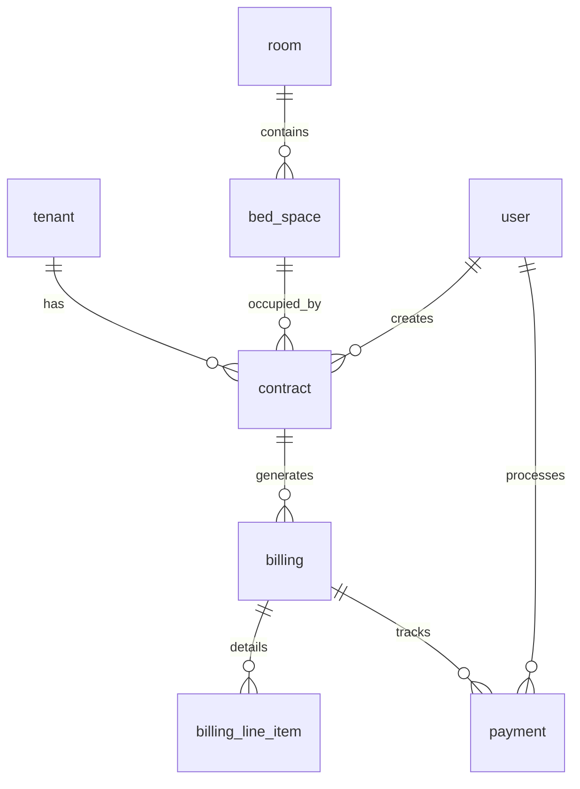

# HavenStay Database Documentation

This document provides a comprehensive overview of the HavenStay Boarding House Management System (BHMS) database architecture. The system is designed for strict data integrity, auditability, and operational reporting.

## Canonical schema files

The **same** InnoDB DDL is maintained in two locations (keep them identical when changing schema):

- `db/havenstay_schema.sql` — repository canonical path cited by SRS/SDD/CLAUDE.md  
- `backend/database/sql/havenstay_schema.sql` — loaded by `2026_04_09_092954_create_havenstay_master_schema.php` on MySQL

SQLite test/dev builds use the migration’s `createTables()` / `createViews()` mirror of this schema.

## Schema Overview

The database consists of **11 tables**, **6 views**, and **24 audit triggers**. It uses the InnoDB engine for transactional support and referential integrity.

### Primary Database Entities

1.  **`roles`**: Defines system access levels (`admin`, `staff`, `viewer`).
2.  **`users`**: System operators and administrators.
3.  **`tenants`**: Comprehensive tenant profiles and status tracking.
4.  **`rooms`**: Physical room management (Solo/Shared, Rate, Status).
5.  **`bed_spaces`**: Specific occupancy units within rooms.
6.  **`contracts`**: The binding relationship between tenants and bed spaces.
7.  **`billing`**: Periodic billing cycles for active contracts.
8.  **`billing_line_items`**: Granular breakdown of charges (Rent, Utilities, Penalties).
9.  **`payments`**: Payment processing and voidance history.
10. **`audit_logs`**: Row-level change log populated by **CCR-008** triggers (and optional `AuditService` inserts).
11. **`transaction_logs`**: Workflow-level events for **CCR-007** (application-layer `DB::transaction()` boundaries).

### `transaction_logs.status` values

| Status | When it is used |
| :--- | :--- |
| `started` | Row inserted by `TransactionService::logStarted()` before the workflow runs. |
| `committed` | `TransactionService::logCommitted()` after a successful workflow. |
| `rolled_back` | `TransactionService::logRolledBack()` after a **`DB::transaction()`** closure throws (Laravel rolls back SQL work). Used by contract, payment, billing, and room configuration workflows. |
| `failed` | `TransactionService::logFailed()` for workflows **without** a multi-statement `DB::transaction()` rollback (e.g. `TenantService` create/update). |

The system includes six core views designed to simplify complex reporting joins and satisfy CCR-005:

| View Name | Purpose | Key Joins |
| :--- | :--- | :--- |
| **`vw_billing_summary`** | Provides a complete financial profile for each billing cycle, including tenant name and room details. | 5-table join |
| **`vw_active_contracts`** | Lists all current occupants with contact info and room rates. | 5-table join |
| **`vw_room_occupancy`** | Real-time aggregation of room capacity, occupied beds, and vacancy levels. | Aggregation |
| **`vw_occupancy_status`** | Per-bed occupancy tracking with current tenant and contract context. | 5-table join |
| **`vw_collections_summary`** | Detailed payment collections tracking with entity context (FR-032b). | 5-table join |
| **`vw_tenant_contract_history`** | Complete historical record of all contracts for all tenants (FR-031). | 4-table join |

## Compliance & Audit (CCR-008)

To ensure strict compliance with audit requirements, the database implements **24 dedicated triggers**.

- **Scope**: Every `INSERT`, `UPDATE`, and `DELETE` on the 8 core tables (including billing line items) is automatically logged to `audit_logs`.
- **Logic Isolation**: Triggers are strictly for auditing. Business logic and status transitions are handled at the Application (Service) layer to ensure maintainability.
- **Context Injection**: The `audit_logs` table captures the `user_id` of the operator responsible for the change by referencing the `@app_user_id` session variable set by the `AuditService`.

## Entity Relationships

> [!NOTE]
> All primary keys use the specific naming convention `<entity>_id` (e.g., `tenant_id`) rather than generic `id` to ensure clarity in complex multi-table joins.

---

*Last Updated: April 2026*
