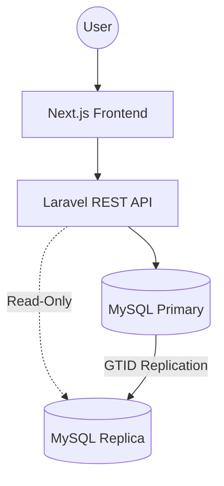

# HavenStay Boarding House Management System (BHMS)
## System Design Document (SDD)

**Version:** 3.2  
**Last Updated:** April 17, 2026  
**Status:** Canonical architectural design and forensic implementation patterns

---

## Table of Contents

1. [Purpose and Scope](#1-purpose-and-scope)
2. [Design Goals](#2-design-goals)
3. [Architecture Overview](#3-architecture-overview)
4. [Database Design](#4-database-design)
5. [Transaction Design](#5-transaction-design)
6. [Query and Reporting Design](#6-query-and-reporting-design)
7. [Security and Access Design](#7-security-and-access-design)
8. [Non-Functional Design Considerations](#8-non-functional-design-considerations)
9. [Course Compliance Mapping](#9-course-compliance-mapping)
10. [Design Decisions and Rationale](#10-design-decisions-and-rationale)
11. [Open Implementation Notes](#11-open-implementation-notes)
12. [Traceability to SRS](#12-traceability-to-srs)
13. [Revision History](#13-revision-history)

---

## 1. Purpose and Scope

This System Design Document (SDD) translates the requirements defined in [**SRS.md**](SRS.md) into a concrete technical architecture for HavenStay BHMS. It defines the implementation strategies for the presentation, application, and data layers, including transaction control, workflow orchestration, and forensic auditing.

### 1.1 Document Boundary
The SDD is the authoritative reference for the **how** of the system. While the SRS defines capabilities and constraints, the SDD specifies the frameworks, database schema, module relationships, and implementation patterns required to realize those capabilities.

---

## 2. Design Goals

- **Data Integrity:** Ensure the integrity of the tenant‑bed‑contract‑billing‑payment relationship chain.
- **Granular Tracking:** Support bed‑level occupancy tracking for shared and solo rooms.
- **Accountability:** Provide high‑fidelity, trigger‑based audit trails and workflow transaction logs.
- **Standardized Reporting:** Utilize standardized database views to ensure reporting consistency across all interfaces.
- **Course Compliance:** Satisfy all academic requirements (CCR-001 through CCR-008) through robust design patterns.

---

## 3. Architecture Overview

### 3.1 Logical Architecture (Three‑Tier)

- **Presentation Layer:** Next.js web application utilizing a component-based design system and a role‑aware navigation architecture.
- **Application Layer:** Laravel REST API responsible for business logic, RBAC enforcement, input validation, and transaction orchestration.
- **Data Layer:** MySQL relational database with InnoDB‑driven ACID compliance, forensic triggers, and reporting views.

### 3.2 Technology Stack

| Layer | Technology | Version |
| :--- | :--- | :--- |
| **Backend Framework** | Laravel (PHP 8.3+) | 13.x |
| **Frontend Framework** | Next.js (App Router) | 16.x |
| **Frontend Styling** | Tailwind CSS | v4.x |
| **Database (Primary)** | MySQL (InnoDB) | 8.4+ |
| **Database (Dev/Test)** | SQLite | — |
| **API Architecture** | RESTful JSON | — |
| **Authentication** | Laravel Sanctum | 4.x |

### 3.3 Deployment Topology (CCR-002)
The system utilizes a primary‑replica architecture to satisfy distributed database requirements. All write operations are directed to the primary instance, while read-only reporting queries are routable to the replica via Laravel's connection splitting. Detailed setup is documented in `docs/DISTRIBUTED_DB_SETUP.md`.

---

## 4. Database Design

### 4.1 Design Philosophy
The database is normalized to the 3rd Normal Form (3NF) where operationally practical, specifically to ensure that financial and occupancy data are derived from singular points of truth. The schema consists of **11 tables**, **6 reporting views**, and **24 forensic triggers**.

> **Schema Authority:** `db/havenstay_schema.sql` is the canonical DDL. 

### 4.2 Core Entities (CCR-001)

| Table | Purpose | Logic |
| :--- | :--- | :--- |
| `roles` | Role definitions (Admin, Staff, Viewer) | Reference data |
| `users` | Authenticated system accounts | Soft Delete |
| `tenants` | Boarding house tenant profiles | Soft Delete |
| `rooms` | Room inventory and pricing | Soft Delete |
| `bed_spaces` | Individual bed occupancy tracking | Referential Lock |
| `contracts` | Rental agreements (anchored to `bed_space_id`) | Soft Delete |
| `billing` | Monthly billing cycle headers | Immutable |
| `billing_line_items` | Itemized charges and adjustments | Immutable |
| `payments` | Transactional records with soft‑void support | Soft Void |
| `audit_logs` | Row‑level change logs (Trigger-written) | Append-Only |
| `transaction_logs` | Workflow-level outcome logs | Append-Only |

### 4.3 Data Relationship Architecture
- **Bed-Centric Occupancy:** All contracts are linked to a `bed_space_id`. Room context is derived via `bed_spaces.room_id`. This prevents data anomalies where a tenant might be assigned to a room but not a specific bed space.
- **Derived Financials:** The `billing` table does not store total amounts. Instead, `total_amount`, `total_paid`, and `balance` are computed dynamically from the `billing_line_items` and `payments` relationships to ensure data consistency.
- **Forensic Linkage:** All audit and transaction records are linked via a `correlation_id` across the session, allowing an Admin to trace a single UI action (e.g., Check-in) to multiple row‑level changes in the audit log.

### 4.4 Status Synchronization Logic
The system enforces strict status transitions to maintain occupancy integrity:
- **Room Status:** Synced with bed occupancy. A room is "available" if it has at least one vacant bed; "unavailable" if all beds are occupied.
- **Bed Status:** "vacant", "occupied", "maintenance". Contracts can only be created for "vacant" beds.
- **Sync Authority:** `RoomService::syncStatusAndCapacity()` is the authoritative service method for reconciling these states during check‑in and move‑out workflows.

### 4.5 Financial Recalculation (BR-007, BR-008)
- **Void Support:** Payments utilize a `voided_at` timestamp. All balance computations must use a `whereNull('voided_at')` filter.
- **Balance Logic:** 
    - `total_amount` = `SUM(billing_line_items.amount)`
    - `total_paid` = `SUM(payments.amount_paid)` (non‑voided)
    - `balance` = `total_amount - total_paid`
- **Recalculation Authority:** `BillingService::autoUpdateStatus()` is the single source of truth for evaluating billing status priority in sequence: `paid` > `overdue` > `partial` > `unpaid`.
## 5. Transaction Design (CCR-006)

### 5.1 Transaction Management
The system utilizes PHP‑layer `DB::transaction()` to ensure ACID properties for multi‑table writes. Financial operations (bill generation, payment posting, voids) and stateful workflows (check‑in, move‑out) are encapsulated in these boundaries.

### 5.2 Transaction Logging Pattern (CCR-007)
To fulfill the requirement for traceable workflow outcomes, particularly during failures, all critical write operations utilize a `TransactionService` wrapper:
1. **Initiation:** Record a `started` state in the `transaction_logs` table *before* entering the database transaction.
2. **Context:** Initialize the `AuditService` with the acting user's identity and generate a `correlation_id` for the session.
3. **Execution:** Execute business logic within a `DB::transaction()` block.
4. **Conclusion:** Update the log record to `committed` on success, or `rolled_back` on failure.

This pattern ensures that even if a database transaction is reverted, the record of the attempt and its failure remains persistent in the append-only transaction log.

### 5.3 Audit Automation (CCR-008)
Row‑level change logging is handled exclusively by **24 AFTER triggers** on the MySQL primary.
- **Mechanism:** The application sets a session variable `@current_user_id` via the `SetAuditContext` middleware.
- **Triggers:** Capture `INSERT`, `UPDATE`, and `DELETE` events, writing full "before" and "after" JSON snapshots to the `audit_logs` table.

---

## 6. Query and Reporting Design (CCR-004, CCR-005)

### 6.1 Reporting View Architecture
The system utilizes 6 dedicated database views to handle complex JOINS and ensure reporting accuracy. All report endpoints query these views directly to maintain single-source-of-truth logic:

| View | Purpose | SRS Traceability |
| :--- | :--- | :--- |
| `vw_billing_summary` | Void‑aware financial totals | FR-029, FR-030 |
| `vw_active_contracts` | Current tenant/bed mappings | FR-028 |
| `vw_room_occupancy` | Aggregated room-level metrics | FR-028 |
| `vw_occupancy_status` | Detailed bed‑space availability | FR-028 |
| `vw_collections_summary` | Performance by method/date | FR-032 |
| `vw_tenant_contract_history` | Historical profile ledger | FR-031 |

### 6.2 SQL Operator Implementation
Reporting filters utilize standard SQL operators via Eloquent query builders:
- **`BETWEEN`**: Used for date‑range filtering in collections and billing reports.
- **`LIKE`**: Used for partial name and contact matching in tenant searches.
- **`IS NULL`**: Used to filter out voided payments and archived records.
- **`AND`/`OR`**: Used for complex status and receivable state filtering.

---

## 7. Security and Access Design

- **Authentication:** Token‑based authentication via Laravel Sanctum.
- **Authorization:** Centralized in the `AuthorizationService`. Controllers shall calling `AuthorizationService::can*()` methods to enforce role‑based permissions (Admin, Staff, Viewer).
- **Passwords:** Securely hashed using Bcrypt. 
- **Audit Context:** The `SetAuditContext` middleware ensures that every request is tagged with the authenticated user's ID for the database forensic triggers.

---

## 8. Non-Functional Design Considerations

- **Performance:** Database indexing on high‑traffic columns (tenant search, status flags, correlation IDs). Use of non‑blocking GTID‑based replication for reports.
- **Reliability:** ACID-compliant transactions ensure that financial data remains consistent even during system failures.
- **Maintainability:** Clear separation between the UI, API services, and trigger‑based data auditing.

---

## 9. Course Compliance Mapping (CCR)

The following design decisions satisfy the binding constraints of the Information Management course:

| CCR | Requirement | Design Realization |
| :--- | :--- | :--- |
| **CCR-001** | Relational Model | 11 Normalized tables in MySQL InnoDB |
| **CCR-002** | Distributed Data | Primary‑Replica topology with GTID replication |
| **CCR-003** | SQL CRUD | Service‑layer Eloquent/SQL implementation |
| **CCR-004** | SQL Operators | Date‑range (BETWEEN), Search (LIKE), Filters (AND/OR) |
| **CCR-005** | SQL JOINs | 6 Automated views utilizing complex INNER/LEFT JOINS |
| **CCR-006** | ACID Transactions | Explicit `DB::transaction()` boundaries in services |
| **CCR-007** | Transaction Logs | Append‑only `transaction_logs` capturing started/committed/failed |
| **CCR-008** | Change Audit | 24 AFTER triggers capturing attribute snapshots |

---

## 10. Key Design Decisions

| Decision | Rationale |
| :--- | :--- |
| **Service-Layer Transactions** | Ensures atomicity across multiple tables (e.g., Billing + Line Items) without relying on DB‑internal stored procedures. |
| **Trigger-Based Auditing** | Guarantees that all data changes are logged regardless of how the change is initiated (API, Console, or Direct SQL). |
| **Derived Financial Totals** | Eliminates sum‑sync bugs by computing balances at the query level (Views/Accessors). |
| **Bed‑Level Inventory** | Provides the granularity required to track shared rooms and bed‑specific maintenance. |

---

## 11. Implementation Notes

- **Forensic Audit Coverage:** All 24 triggers are implemented and validated. Role‑level changes are captured in the unified `audit_logs` table.
- **Reporting Consistency:** Standardized views (`vw_*`) ensure that "Last, First" name formatting and void‑aware balance logic are consistent across all reports.
- **Correlation Propagation:** The `AuditService` ensures that the `correlation_id` is propagated from the service layer down to the database triggers.

---

## 12. Traceability to SRS

| SRS Requirement Set | Architecture / Module |
| :--- | :--- |
| **Authentication (FR-001–004)** | `AuthController`, `users`, `AuthorizationService`, `AuditService` |
| **User Management (FR-005–007)** | `UserController`, `roles`, `soft-delete` |
| **Tenant Management (FR-008–011a)** | `TenantService`, `tenants`, `soft-delete` |
| **Room Management (FR-012–015a)** | `RoomService`, `rooms`, `bed_spaces`, `STASTUS_ENUM` |
| **Contract Management (FR-016–019d)** | `ContractService`, `contracts`, `move-out workflow` |
| **Billing Management (FR-020–023)** | `BillingService`, `billing`, `billing_line_items`, `autoUpdateStatus` |
| **Payment Management (FR-024–027a)** | `PaymentService`, `payments`, `soft-void` |
| **Reporting (FR-028–032)** | `ReportService`, 6 Reporting Views (`vw_*`) |
| **Operational Dashboard (FR-033–033a)** | `DashboardController`, Aggregate service queries |
| **Forensic Logging (FR-034–036)** | `TransactionService`, `audit_logs`, `transaction_logs`, 24 Triggers |
| **System Integrity (FR-037–040)** | MySQL Check Constraints, `RoomService` sync logic |

---

## 13. Revision History

| Version | Date | Changes |
| :--- | :--- | :--- |
| v1.0–v2.6 | 2026-03–04 | Initial architecture through compliance remediation and hardening. |
| v2.7 | 2026-04-17 | Core-doc standardization pass; added document boundary. |
| v3.1 | 2026-04-17 | Final forensic cleanup and alignment pass. Synchronized functional requirements with canonical schema constraints (24 triggers); corrected billing status priority (paid > overdue > partial > unpaid) to match SRS BR-009; polished RBAC design notes. |
| **v3.2** | **2026-04-17** | **Final audit accuracy and metadata sync pass.** Synchronized all version pointers to SRS v4.6 baseline; corrected architectural residue in forensic mapping. |

---

*Aligned to: SRS.md v4.7 · db/havenstay_schema.sql (canonical) · API_REFERENCE.md v2.2 · OPERATIONS_RUNBOOK.md · TEST_PLAN.md v4.2*  
*Last Updated: April 17, 2026 (v3.2 — final audit alignment pass)*
