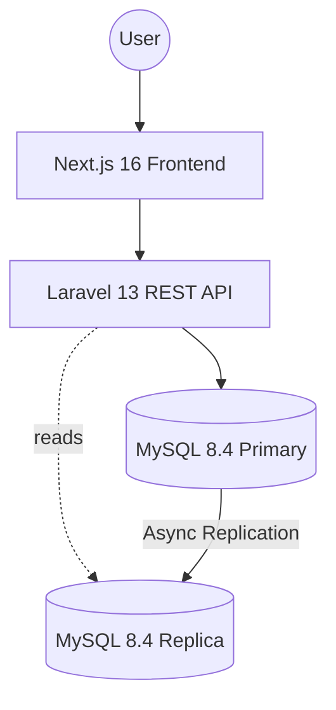

# HavenStay Boarding House Management System (BHMS)
## System Design Document (SDD)

---

## Table of Contents

1. [Purpose and Scope](#1-purpose-and-scope)
2. [Design Goals](#2-design-goals)
3. [Architecture Overview](#3-architecture-overview)
4. [Database Design](#4-database-design)
5. [Transaction Design](#5-transaction-design)
6. [Query and Reporting Design](#6-query-and-reporting-design)
7. [Security and Access Design](#7-security-and-access-design)
8. [Non-Functional Design Considerations](#8-non-functional-design-considerations)
9. [Course Compliance Mapping](#9-course-compliance-mapping)
10. [Design Decisions and Rationale](#10-design-decisions-and-rationale)
11. [Open Implementation Notes](#11-open-implementation-notes)
12. [Traceability to SRS](#12-traceability-to-srs)
13. [Revision History](#13-revision-history)

---

## 1. Purpose and Scope

This System Design Document (SDD) translates [**SRS.md**](SRS.md) requirements into a concrete technical design for HavenStay BHMS. It defines the architecture, module responsibilities, data design, transaction behavior, security, and deployment patterns.

Scope includes:
- Web application architecture and technology stack
- Database schema, entity relationships, and data flow design
- Transaction control and logging strategy (CCR-006, CCR-007)
- Query and reporting design (CCR-004, CCR-005)
- Course compliance mapping (CCR-001 through CCR-008)

> **Schema authority:** `db/havenstay_schema.sql` is the canonical DDL. This document describes the schema as it exists in that file. The schema must never be modified to match this document — only this document is updated to reflect the schema.

---

## 2. Design Goals

- Ensure data integrity for the tenant → bed space → contract → billing → payment relationship chain.
- Support bed-level occupancy tracking for all room types through the `bed_spaces` entity.
- Enforce role-based access and accountability through persistent audit trails.
- Keep the system practical for small boarding house operations.
- Satisfy all Information Management course database requirements (CCR-001 to CCR-008).

---

## 3. Architecture Overview

### 3.1 Logical Architecture

Three-tier architecture:



- **Presentation layer:** Next.js web UI consumed by Admin, Staff, and Viewer roles.
- **Application layer:** Laravel REST API handling business logic, RBAC, validation, and service orchestration.
- **Data layer:** MySQL 8.4+ (InnoDB) relational database with triggers, views, and transactional consistency guarantees via PHP-layer `DB::transaction()`.

### 3.2 Module Breakdown

| Module | Description |
| :--- | :--- |
| Authentication and Access Control | Token-based login, logout, role enforcement |
| User and Role Management | CRUD for user accounts and role assignment |
| Tenant Management | Tenant profiles, status management, search |
| Room and Bed Space Management | Room inventory, bed-level occupancy tracking |
| Contract Management | Rental agreement creation and move-out processing |
| Billing Management | Monthly billing cycle generation and line items |
| Payment Processing | Payment posting, void, balance recalculation |
| Reporting and Dashboard | Occupancy, billing, and receivables reports |
| Audit and Transaction Logging | Row-level change logs and workflow transaction records |

### 3.3 Deployment Topology (CCR-002)

- Application server connects to the MySQL **primary (source)** instance for all writes.
- Read operations are routable to **replica** nodes via Laravel read/write connection splitting (`DB_READ_HOST` in `.env`).
- MySQL primary-replica replication (GTID-based) satisfies the distributed database requirement (CCR-002).
- Setup procedure: `docs/DISTRIBUTED_DB_SETUP.md`.

### 3.4 Technology Stack

| Layer | Technology | Version |
| :--- | :--- | :--- |
| **Backend framework** | Laravel (PHP 8.3+) | 13 |
| **Frontend framework** | Next.js (App Router) | 16.x |
| **Frontend library** | React | 19.x |
| **Frontend styling** | Tailwind CSS | v4 |
| **Frontend forms** | React Hook Form | 7.x |
| **Primary database** | MySQL (InnoDB) | 8.4+ |
| **Development database** | SQLite | — |
| **Backend auth** | Laravel Sanctum | 4.x |
| **API style** | RESTful JSON | — |

---

## 4. Database Design

### 4.1 Design Summary

The database is normalized around a core operational chain: `roles → users`, `rooms → bed_spaces`, `tenants → contracts (via bed_space) → billing → billing_line_items → payments`. The schema uses foreign keys, check constraints, performance indexes, triggers, and reporting views. There are no stored procedures in the current schema — all transaction control is handled by the PHP application layer via `DB::transaction()`.

### 4.2 Core Entities (CCR-001: 11 tables)

| Table | Primary Key | Purpose |
| :--- | :--- | :--- |
| `roles` | `role_id` | Role definitions: admin, staff, viewer |
| `users` | `user_id` | System user accounts |
| `tenants` | `tenant_id` | Boarding house tenant profiles |
| `rooms` | `room_id` | Room inventory |
| `bed_spaces` | `bed_space_id` | Per-bed occupancy for all room types |
| `contracts` | `contract_id` | Rental agreements, linked via `bed_space_id` |
| `billing` | `billing_id` | Monthly billing cycle headers (no amount columns) |
| `billing_line_items` | `billing_line_item_id` | Itemized charges per billing cycle |
| `payments` | `payment_id` | Payment transactions with soft-void support |
| `audit_logs` | `audit_log_id` | Row-level change log written by triggers |
| `transaction_logs` | `tx_log_id` | Workflow-level transaction state log |

### 4.3 Critical Entity Relationships

- One role → many users.
- One room → many bed spaces. **All contract and occupancy tracking flows through `bed_spaces`** — there is no direct `room_id` on `contracts`.
- One tenant → many contracts (over tenancy history).
- One contract links to one `bed_space_id` (NOT NULL). Room is resolved via `contracts.bed_space_id → bed_spaces.room_id`.
- One contract → many billing cycles.
- One billing cycle → many line items; amounts summed dynamically — **`billing` has no `amount_due` or `amount_paid` columns**.
- One billing cycle → many payments. Non-voided payments are summed to compute `total_paid`.
- `audit_logs` and `transaction_logs` reference `users` via nullable FKs (`ON DELETE SET NULL`).

### 4.4 Billing Amount Architecture

The `billing` table stores only the cycle header. There are **no `amount_due` or `amount_paid` columns**.

| Value | Source |
| :--- | :--- |
| `total_amount` | `SUM(billing_line_items.amount)` WHERE `billing_id = ?` |
| `total_paid` | `SUM(payments.amount_paid)` WHERE `billing_id = ?` AND `voided_at IS NULL` |
| `balance` | `total_amount - total_paid` |

The `Billing` model exposes these as appended accessors. `BillingService::autoUpdateStatus()` is the single authority for status recalculation and must be called after every payment post and void.

**`Billing::updateStatus()` (model method) is deprecated.** Its logic differs from `autoUpdateStatus()` and produces incorrect results after voids. It must not be called. See Open Implementation Notes.

### 4.5 Room Status ENUM

The `rooms.status` ENUM is `('available', 'unavailable', 'maintenance')`.

| Value | Meaning |
| :--- | :--- |
| `available` | No beds occupied, or shared room has vacant beds remaining |
| `unavailable` | All beds occupied (solo or fully occupied shared room) |
| `maintenance` | Manually set; never auto-assigned by `syncStatusAndCapacity()` |

Application code must use `Room::STATUS_AVAILABLE`, `Room::STATUS_UNAVAILABLE`, and `Room::STATUS_MAINTENANCE` constants. The string `'occupied'` is **not a valid ENUM value** and must never be written to `rooms.status`.

### 4.6 Payment Void Support

The `payments` table includes soft-void columns: `voided_at DATETIME NULL`, `voided_by INT NULL`, `void_reason VARCHAR(255) NULL`. Voiding a payment sets `voided_at` to the current timestamp; the row is never deleted. All balance computations must filter voided payments with `WHERE voided_at IS NULL`.

### 4.7 Schema Design Decisions

| Decision | Rationale |
| :--- | :--- |
| `roles` as a separate table | Extensibility; satisfies CCR-001 as a discrete entity |
| `bed_spaces` as the contract anchor | All contracts link to a bed; room is derived via FK; eliminates room-contract sync bugs |
| No `room_id` on `contracts` | Room derived via `bed_space → room`; prevents redundancy and dual-source inconsistency |
| `billing` has no amount columns | Amounts derived from relations; eliminates dual-source inconsistency |
| `payments.voided_at` soft-void | Preserves financial history; allows reconciliation audit of voided transactions |
| No stored procedures | PHP-layer `DB::transaction()` is sufficient; eliminates MySQL-only execution dependency |
| `audit_logs` and `transaction_logs` separated | Row-level change records vs. workflow-level state records serve different concerns |

### 4.8 Primary Key Naming Convention

All tables use domain-prefixed primary keys (e.g., `tenant_id`, `room_id`, `billing_id`) rather than generic `id`. Laravel migrations use the default `id` column, which maps to the same underlying column. Application code references `$model->id` for the Eloquent PK; the schema column name is the prefixed form. This duality is intentional and must be maintained.

---

## 5. Transaction Design (CCR-006)

### 5.1 Critical Transaction Boundaries

All critical write workflows use PHP-layer `DB::transaction()`. There are no stored procedures.

| Workflow | Mechanism | Tables Modified |
| :--- | :--- | :--- |
| Room creation / update | `DB::transaction()` | `rooms`, `bed_spaces` |
| Contract creation | `DB::transaction()` | `contracts`, `bed_spaces`, `rooms` |
| Move-out processing | `DB::transaction()` | `contracts`, `bed_spaces`, `rooms` |
| Billing generation | `DB::transaction()` | `billing`, `billing_line_items` |
| Payment posting | `DB::transaction()` + `transaction_logs` | `payments`, `billing`, `transaction_logs` |
| Payment void | `DB::transaction()` + `transaction_logs` | `payments`, `billing`, `transaction_logs` |
| Tenant Check-in | `DB::transaction()` + `transaction_logs` | `contracts`, `tenants`, `bed_spaces`, `transaction_logs` |
| Tenant Move-out | `DB::transaction()` + `transaction_logs` | `contracts`, `tenants`, `bed_spaces`, `transaction_logs` |

### 5.2 Transaction Log Pattern (CCR-007)

All financial write workflows (payment post, payment void) follow this wrapper:

```php
// 1. INSERT 'started' BEFORE the transaction — survives rollback.
$txLogId = DB::table('transaction_logs')->insertGetId([
    'tx_name'          => 'sp_post_payment_fallback',
    'started_at'       => now(),
    'status'           => 'started',
    'initiated_by'     => $actor->id,
    'reference_entity' => 'billing',
    'reference_id'     => (string) $data['billing_id'],
]);

try {
    $result = DB::transaction(function () use (...) { /* work */ });

    // 2. UPDATE to 'committed' after success.
    DB::table('transaction_logs')->where('tx_log_id', $txLogId)->update([
        'completed_at' => now(), 'status' => 'committed', 'details_json' => json_encode([...]),
    ]);

    return $result;
} catch (\Throwable $e) {
    // 3. UPDATE to 'failed' — runs outside the rolled-back transaction.
    DB::table('transaction_logs')->where('tx_log_id', $txLogId)->update([
        'completed_at' => now(), 'status' => 'failed', 'details_json' => json_encode(['reason' => $e->getMessage()]),
    ]);
    throw $e;
}
```

**Critical rule:** The `transaction_logs` INSERT must occur **before** `DB::transaction()`. If placed inside the transaction, a rollback erases the failure record, violating CCR-007.

### 5.3 Audit Context Pattern (CCR-008)

Before any `DB::transaction()` that touches a trigger-covered table on MySQL, the application sets session variable `@app_user_id`:

```php
// Set BEFORE the transaction, not inside it.
AuditService::setAuditUserContext($actor->id);

return DB::transaction(function () use (...) {
    // trigger-covered writes here
});
```

`SetAuditContext` middleware is registered in `bootstrap/app.php` as part of the `api` middleware group, initializing `@app_user_id` on every API request. Service-level calls override this with the authenticated actor's ID.

### 5.4 Trigger-Based Change Logging (CCR-008)

`AFTER INSERT`, `AFTER UPDATE`, and `AFTER DELETE` triggers on:

`users` (3) + `tenants` (3) + `rooms` (3) + `bed_spaces` (3) + `contracts` (3) + `billing` (3) + `payments` (3) + `billing_line_items` (3) = **24 triggers total**

Each trigger writes to `audit_logs`: `entity_name`, `entity_id`, `action`, `old_values_json`, `new_values_json`, `created_at`, and `user_id` from `@app_user_id`.

**Dual-logging note:** Service methods also call `AuditService::log*()` which directly inserts into `audit_logs`. This produces two entries per CRUD operation: one from the trigger (database layer, fires even on direct DB writes) and one from the service (application layer, includes workflow context). This is intentional defense-in-depth.

---

## 6. Query and Reporting Design (CCR-004, CCR-005)

### 6.1 Reporting Views (CCR-005: SQL JOIN compliance)

Six views are defined in `db/havenstay_schema.sql`. All report endpoints query these views directly — they must not be replaced with inline Eloquent queries.

| View | Tables Joined | Purpose |
| :--- | :--- | :--- |
| `vw_billing_summary` | `billing` INNER JOIN `contracts`, `tenants`, `bed_spaces`, `rooms` | Billing with void-aware `total_amount` and `total_paid` |
| `vw_active_contracts` | `contracts` INNER JOIN `tenants`, `bed_spaces`, `rooms` | Active contracts with full entity context |
| `vw_room_occupancy` | `rooms` LEFT JOIN `bed_spaces` (aggregated) | Per-room occupancy counts |
| `vw_occupancy_status` | `bed_spaces` INNER JOIN `rooms`, LEFT JOIN `contracts`, `tenants` | Per-bed occupancy with current tenant |
| `vw_collections_summary` | `payments` INNER JOIN `billing`, `contracts`, `tenants`, `rooms` | Payment collections tracking (FR-032b) |
| `vw_tenant_contract_history` | `contracts` INNER JOIN `tenants`, `bed_spaces`, `rooms` | Historical record of all contracts (FR-031) |

### 6.2 SQL Operator Usage (CCR-004)

| Operator | Usage Location |
| :--- | :--- |
| `LIKE` | Tenant search by name and contact (`TenantService::search`) |
| `AND` / `OR` | Multi-condition where clauses in search and filter queries |
| `BETWEEN` | Date range filtering in billing summary and outstanding balances (CCR-004) |
| `IS NULL` | Void filter on payments in views and service queries |

---

## 7. Security and Access Design

- **Authorization:** `AuthorizationService` is the **only** authorization path. `Gate::authorize()` is **not permitted** per CLAUDE.md Section 6.3. All controllers call `AuthorizationService::can*()` methods.
- **Authentication:** Laravel Sanctum bearer tokens. Token created on login, deleted on logout.
- **Passwords:** bcrypt via Laravel's default `password` cast.
- **Audit context:** `SetAuditContext` middleware ensures `@app_user_id` is initialized for all API requests.

---

## 8. Non-Functional Design Considerations

- **Indexing:** Composite indexes on high-traffic filter columns: `(tenant_id, status)` on contracts, `(contract_id, status)` on billing, `(billing_id, payment_date)` on payments, `(entity_name, entity_id)` on audit_logs, `(status, started_at)` on transaction_logs.
- **Data retention:** Soft-void on payments and status flags on tenants/contracts preserve all historical records. No hard deletes on financial data.
- **SQLite compatibility:** SQLite is used for local dev and unit tests. Migrations create equivalent **reporting views** for automated tests; **MySQL `AFTER` triggers** and full CCR evidence (CCR-007/008) are validated on MySQL (`composer test:mysql`).

---

## 9. Course Compliance Mapping

| CCR | Requirement | Implementation Evidence |
| :--- | :--- | :--- |
| **CCR-001** | ≥ 6 core entities | 11 tables in schema; 10 operational + 1 audit-split (tx_logs) |
| **CCR-002** | Primary-replica distributed DB | `docs/DISTRIBUTED_DB_SETUP.md`; `DB_READ_HOST` in `.env.example` |
| **CCR-003** | SQL CRUD | SELECT/INSERT/UPDATE across all service methods; DELETE on bed space removal |
| **CCR-004** | SQL operators | LIKE/AND/OR in `TenantService::search`; BETWEEN on date-range report filters |
| **CCR-005** | SQL JOINs | 6 views with INNER JOIN and LEFT JOIN; all report endpoints query views directly |
| **CCR-006** | Transaction control | `DB::transaction()` with `lockForUpdate()` on all multi-table financial writes |
| **CCR-007** | Transaction logs | `transaction_logs` table; started/committed/failed records; INSERT before transaction; covers financial and operational workflows |
| **CCR-008** | Trigger-based CRUD logging | 24 AFTER triggers on 8 core tables; capture of full attribute snapshots; `@app_user_id` session variable |

---

## 10. Design Decisions and Rationale

| Decision | Rationale |
| :--- | :--- |
| No stored procedures | PHP `DB::transaction()` provides equivalent atomicity; testable on SQLite; no MySQL-only dependency |
| `contracts` anchored to `bed_space_id` | Eliminates room-contract sync bugs; room always derivable via bed space FK |
| `billing` with no amount columns | Amounts computed from relations; single source of truth; void-safe |
| Soft-void on payments | Preserves financial audit trail; voided payments remain queryable |
| `AuthorizationService` over Gates/Policies | Explicit, testable, consistent; avoids implicit Laravel authorization magic |
| `SetAuditContext` as API middleware | Ensures `@app_user_id` initialized on every API request, not just service writes |
| Expansion to 6 views | Added `vw_collections_summary` and `vw_tenant_contract_history` to support FR-031/FR-032b and provide dedicated reporting evidence |

---

## 11. Open Implementation Notes

Items deliberately deferred or recently resolved.

- **RESOLVED — BUG-001/010:** All identified financial, operational, and auditing bugs have been resolved as of v2.1.
- **`billing_line_items` triggers:** Implemented in schema; provides full coverage for fee adjustments and rent billing integrity.

---

## 12. Traceability to SRS

| SRS Requirements | Design Coverage |
| :--- | :--- |
| FR-001 to FR-007 | `roles`, `users`, `AuthController`, `UserController`, `AuthorizationService`, `AuditService` |
| FR-008 to FR-011 | `tenants`, `TenantController`, `TenantService` |
| FR-012 to FR-015 | `rooms`, `bed_spaces`, `RoomController`, `RoomService` |
| FR-016 to FR-019 | `contracts`, `ContractController`, `ContractService` |
| FR-020 to FR-023 | `billing`, `billing_line_items`, `BillingController`, `BillingService` |
| FR-024 to FR-027 | `payments`, `PaymentController`, `PaymentService` (post + void) |
| FR-028 to FR-032 | 6 reporting views, `ReportController`, `ReportService` |
| FR-033 to FR-035 | `audit_logs`, 24 triggers, `AuditService` |
| FR-036 to FR-039 | DB CHECK constraints, `AFTER` audit triggers on core tables, service-layer validation |
| FR-040 to FR-045 | CRUD across all modules; LIKE/BETWEEN/AND/OR; JOIN views; `DB::transaction()`; `transaction_logs`; 24 AFTER triggers |

---

## 13. Revision History

| Version | Date | Changes |
| :--- | :--- | :--- |
| v1.0 | 2026-03-27 | Initial SDD created. |
| v1.1 | 2026-03-27 | Added trigger-based CRUD change logging design. |
| v1.2 | 2026-03-27 | Added technology stack section. |
| v1.3 | 2026-03-27 | Locked final implementation stack. |
| v1.4 | 2026-03-27 | Added `sp_move_out`, audit actor context via `@app_user_id`, transaction boundary updates. |
| v1.5 | 2026-03-27 | Transaction-log scope clarification and billing line-item audit note. |
| v1.6 | 2026-04-09 | Major corrections: heading fixes, PK/FK alignment note, CCR mapping expansion. |
| v1.7 | 2026-04-09 | Mermaid architecture diagram; double-logging behavior documented. |
| v1.8 | 2026-04-10 | Schema-accurate rewrite: Corrected contracts (no `room_id`); corrected billing (no amount columns); corrected rooms ENUM (`unavailable` not `occupied`); updated view count to 4; documented void support; removed stored procedure references; established `BillingService::autoUpdateStatus()` as status authority; documented `SetAuditContext` middleware; registered all open bugs by BUG-ID reference. |
| v1.9 | 2026-04-10 | Bugfix implementation complete: Resolved BUG-001 through BUG-009; added CCR annotation comments throughout service layer; verified transaction logging for void operations; confirmed authorization service consistency; validated audit context handling. |
| v2.0 | 2026-04-11 | Reporting Core Expansion: Implemented Detailed Tenant Ledger and Collections Performance report (FR-032b); expanded CCR-005 reporting views (counts finalized in v2.2); synchronized resolved implementation notes. |
| v2.1 | 2026-04-11 | Audit & Nomenclature Parity: Standardized `audit_logs` to capture full snapshots; expanded `transaction_logs` to cover tenant lifecycle; implemented 24 triggers total; achieved 100% nomenclature alignment. |
| v2.2 | 2026-04-11 | Synchronization Finalization: Updated reporting view count to 6 and audit trigger count to 24; synchronized SRS/SDD/CLAUDE version alignment. |
| **v2.3** | **2026-04-11** | **User Entity Hardening:** Synchronized `users` table with the `email` attribute; updated `UserController`, `DemoUatSeeder`, and UI registries to support unified contact logging. |

---

*Aligned to: SRS.md v2.1 · havenstay_schema.sql (canonical) · CLAUDE.md · docs/API_REFERENCE.md (REST routes)*
*Last Updated: April 2026*
