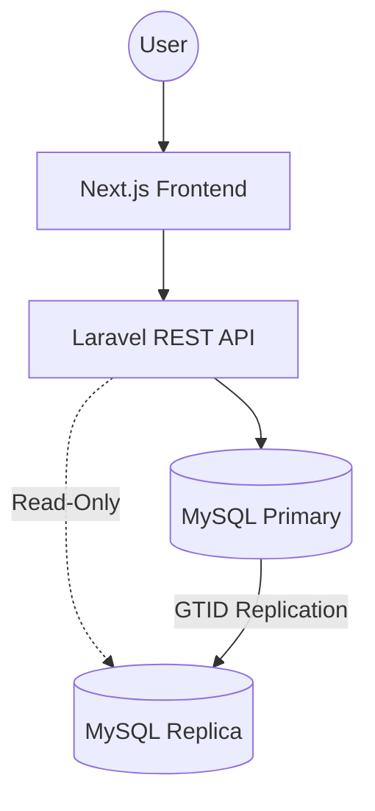

# HavenStay Boarding House Management System (BHMS)
## System Design Document (SDD)

**Version:** 5.4  
**Last Updated:** May 03, 2026  
**Status:** Canonical architectural design and forensic implementation patterns

---

## Table of Contents

1. [Purpose and Scope](#1-purpose-and-scope)
2. [Design Goals](#2-design-goals)
3. [Architecture Overview](#3-architecture-overview)
4. [Database Design](#4-database-design)
5. [Transaction Design](#5-transaction-design)
6. [Query and Reporting Design](#6-query-and-reporting-design)
7. [Security and Access Design](#7-security-and-access-design)
8. [Non-Functional Design Considerations](#8-non-functional-design-considerations)
9. [Course Compliance Mapping](#9-course-compliance-mapping)
10. [Design Decisions and Rationale](#10-design-decisions-and-rationale)
11. [Implementation Notes](#11-implementation-notes)
12. [Traceability to SRS](#12-traceability-to-srs)
13. [Revision History](#13-revision-history)

---

## 1. Purpose and Scope

This System Design Document (SDD) translates the requirements defined in [**SRS.md**](SRS.md) into a concrete technical architecture for HavenStay BHMS. It defines the implementation strategies for the presentation, application, and data layers, including transaction control, workflow orchestration, and forensic auditing.

### 1.1 Document Boundary
The SDD is the authoritative reference for the **how** of the system. While the SRS defines capabilities and constraints, the SDD specifies the frameworks, database schema, module relationships, and implementation patterns required to realize those capabilities.

---

## 2. Design Goals

- **Data Integrity:** Ensure the integrity of the tenant‑bed‑contract‑billing‑payment relationship chain.
- **Granular Tracking:** Support bed‑level occupancy tracking for shared and private rooms.
- **Accountability:** Provide high‑fidelity, trigger‑based audit trails.
- **Standardized Reporting:** Utilize standardized database views to ensure reporting consistency across all interfaces.
- **Course Compliance:** Satisfy all academic requirements (CCR-001 through CCR-007) through robust design patterns.

---

## 3. Architecture Overview

### 3.1 Logical Architecture (Three‑Tier)

- **Presentation Layer:** Next.js web application utilizing a component-based design system and a role‑aware navigation architecture.
- **Application Layer:** Laravel REST API responsible for business logic, RBAC enforcement, input validation, and transaction orchestration.
- **Data Layer:** MySQL relational database with InnoDB‑driven ACID compliance, forensic triggers, and reporting views.

### 3.2 Technology Stack

| Layer | Technology | Version |
| :--- | :--- | :--- |
| **Backend Framework** | Laravel (PHP 8.3+) | 13.x |
| **Frontend Framework** | Next.js (App Router) | 16.x |
| **Frontend Styling** | Tailwind v4 + HS-Utility Layer | — |
| **Database (Primary)** | MySQL (InnoDB) | 8.4+ |
| **Database (Dev/Test)** | SQLite | — |
| **API Architecture** | RESTful JSON | — |
| **Authentication** | Laravel Sanctum | 4.x |

### 3.3 Deployment Topology (CCR-002)
The system utilizes a primary‑replica architecture to satisfy distributed database requirements. All write operations are directed to the primary instance, while read-only reporting queries are routable to the replica via Laravel's connection splitting. Detailed setup is documented in `docs/DISTRIBUTED_DB_SETUP.md`.

---

## 4. Database Design

### 4.1 Design Philosophy
The database is normalized to the 3rd Normal Form (3NF) where operationally practical, specifically to ensure that financial and occupancy data are derived from singular points of truth. The schema consists of **15 tables**, **6 reporting views**, and **45 forensic triggers**.

> **Schema Authority:** Both `db/havenstay_schema.sql` and `backend/database/sql/havenstay_schema.sql` must remain identical. `db/` is the reference for direct database import (e.g., phpMyAdmin/TablePlus). `backend/database/sql/` is the deployment copy used by migrations and CI. Any schema change must be applied to both. 

### 4.2 Core Entities (CCR-001)

| Table | Purpose | Logic |
| :--- | :--- | :--- |
| `roles` | Role definitions (Admin, Staff, Viewer) | Reference data |
| `users` | Authenticated system accounts | Soft Delete |
| `tenants` | Boarding house tenant profiles | Soft Delete |
| `rooms` | Room inventory and pricing | Soft Delete |
| `bed_spaces` | Individual bed occupancy tracking | Referential Lock |
| `contracts` | Rental agreements (anchored to `bed_space_id`) | Soft Delete |
| `utilities` | billable service registry (Electricity, Water, etc.) | Soft Delete |
| `meters` | Physical utility measurement devices | Soft Delete |
| `meter_assignments` | Meter-to-room mapping with effective dates | Temporal |
| `meter_readings` | Point-in-time consumption records | Append-Only |
| `utility_rates` | Unit pricing per utility type | Soft Delete |
| `billing` | Monthly billing cycle headers | Immutable |
| `billing_line_items` | Itemized charges and utility apportionments | Immutable |
| `payments` | Transactional settlement records | Forensic Lock |
| `audit_logs` | Change-set forensics (BEFORE/AFTER snapshots) | Forensic Trail |

### 4.3 Data Relationship Architecture
- **Bed-Centric Occupancy:** All contracts are linked to a `bed_space_id`. Room context is derived via `bed_spaces.room_id`. This prevents data anomalies where a tenant might be assigned to a room but not a specific bed space.
- **Derived Financials:** The `billing` table does not store total amounts. Instead, `total_amount`, `total_paid`, and `balance` are computed dynamically from the `billing_line_items` and `payments` relationships to ensure data consistency.
- **Forensic Linkage:** All audit records are linked via a `correlation_id` across the session, allowing an Admin to trace a single UI action (e.g., Check-in) to multiple row‑level changes in the audit log.
- **Dual-Path Payment Transparency:** To prevent orphan financial records, the system implements a dual-path resolution strategy for payments. The `payments` table utilizes an XOR constraint (`billing_id` XOR `contract_id`). API resources and reporting views (`vw_collections_summary`) are architected to resolve tenant and room context through either path, ensuring that both Rent (Billing-linked) and Deposits (Contract-linked) are fully traceable.
- **Billing Rate Resolution:** When generating a `base_rent` line item, the system resolves the effective rate as `COALESCE(contracts.monthly_rate_override, contracts.monthly_rate)`. The override is Admin-set and locked at contract creation (BR-CON-013).

### 4.4 Status Synchronization Logic
The system enforces strict status transitions to maintain occupancy integrity:
- **Room Status:** Synced with bed occupancy. A room is "available" if it has at least one vacant bed; "unavailable" if all beds are occupied.
- **Bed Status:** "vacant", "occupied", "maintenance". Contracts can only be created for "vacant" beds, with a strict system exception allowing contiguous renewals on "occupied" beds (BR-CON-011).
- **Sync Authority:** `RoomService::syncStatusAndCapacity()` is the authoritative service method for reconciling these states during check‑in and move‑out workflows.

### 4.5 Financial Recalculation (BR-BIL-006, BR-BIL-007)
- **Void Support:** Payments utilize a `voided_at` timestamp. All balance computations must use a `whereNull('voided_at')` filter.
- **Voided Contracts:** Contracts in `voided` status are creation-error corrections (BR-CON-012). They are excluded from all active tenant/room occupancy queries identically to `completed` and `terminated` contracts.
- **Balance Logic:** 
    - `total_amount` = `SUM(billing_line_items.amount)`
    - `total_paid` = `SUM(payments.amount_paid)` (non‑voided)
    - `balance` = `total_amount - total_paid`
- **Recalculation Authority:** `BillingService::syncBillingStatus()` is the single source of truth for evaluating billing status priority in sequence: `paid` > `overdue` > `partial` > `unpaid`. (Ref: BR-BIL-006)
- **Fail-Safe Batch Processing:** Room-level billing operations are architected as resilient batch workflows. The `BatchBillingProcessor` implements a non-blocking loop that traps validation exceptions (e.g., overlapping periods) for individual contracts, logging the failure while allowing the rest of the room to be processed. This prevents local data conflicts from stalling global utility distribution.

---

## 5. Transaction Design (CCR-006)

### 5.1 Transaction Management
The system utilizes PHP‑layer `DB::transaction()` to ensure ACID properties for multi‑table writes. Financial operations (bill generation, payment posting, voids) and stateful workflows (check‑in, move‑out) are encapsulated in these boundaries.

### 5.2 Audit Automation (CCR-007)
Row‑level change logging is handled exclusively by **45 database triggers** on the MySQL primary.
- **Mechanism:** The application sets a session variable `@current_user_id` via the `SetAuditContext` middleware.
- **Triggers:** `AFTER INSERT/UPDATE/DELETE` events across 14 tables write full JSON snapshots to `audit_logs`. The `meter_assignments` table receives a fourth trigger — a `BEFORE INSERT` guard — in addition to the standard three, enforcing BR-MET-003 integrity at the DB engine level. The full breakdown is: (13 tables × 3 AFTER triggers) + (1 table [`meter_assignments`] × 4 triggers [AFTER INSERT + AFTER UPDATE + AFTER DELETE + BEFORE INSERT]) + 2 immutability triggers (BEFORE UPDATE + BEFORE DELETE on `audit_logs`) = **45 triggers total**.
- **Immutability:** Protected by engine-level triggers that prevent any modification of the log history.

### 5.3 Philippine Compliance Workflows

**Two-Phase Check-In:** To prevent phantom occupancy and double-booking, the `ContractService` initializes all new leases by atomically marking the bed space as `occupied` (immediate reservation lock) regardless of whether the contract is in a `pending_payment` or `active` state. The room availability views (`vw_occupancy_status`) are configured to treat both states as occupied to ensure single-source-of-truth inventory management.

**Gate Pass Clearance:** The move-out transaction enforces a hard zero-balance check. The system will roll back any attempt to transition a contract to completed if the associated billing records have an outstanding balance > ₱0.00.

---

## 6. Query and Reporting Design (CCR-004, CCR-005)

### 6.1 Reporting View Architecture (Admin Only)
The system utilizes 6 dedicated database views to handle complex JOINS and ensure reporting accuracy. Access to these views via the API is strictly restricted to the Admin role. All report endpoints query these views directly to maintain single-source-of-truth logic:

| View | Purpose | SRS Traceability |
| :--- | :--- | :--- |
| `vw_billing_summary` | Void‑aware financial totals | FR-046, FR-047 |
| `vw_active_contracts` | Current tenant/bed mappings | FR-049 |
| `vw_room_occupancy` | Aggregated room-level metrics | FR-045 |
| `vw_occupancy_status` | Detailed bed‑space availability | FR-045 |
| `vw_collections_summary` | Performance by method/date | FR-048 |
| `vw_tenant_contract_history` | Historical profile ledger | FR-050, FR-051 |

### 6.2 SQL Operator Implementation
Reporting filters utilize standard SQL operators via Eloquent query builders:
- **`BETWEEN`**: Used for date‑range filtering in collections and billing reports.
- **`LIKE`**: Used for partial name and contact matching in tenant searches.
- **`IS NULL`**: Used to filter out voided payments and archived records.
- **`AND`/`OR`**: Used for complex status and receivable state filtering.

---

## 7. Security and Access Design

- **Authentication:** Token‑based authentication via Laravel Sanctum.
- **Authorization:** Centralized in the `AuthorizationService`. Controllers shall call `AuthorizationService::can*()` methods to enforce role‑based permissions (Admin, Staff, Viewer).
- **Passwords:** Securely hashed using Bcrypt. 
- **Audit Context:** The `SetAuditContext` middleware ensures that every request is tagged with the authenticated user's ID for the database forensic triggers.

---

## 8. Non-Functional Design Considerations

- **Performance:** Database indexing on high‑traffic columns (tenant search, status flags, correlation IDs). Use of non‑blocking GTID‑based replication for reports.
- **Reliability:** ACID-compliant transactions ensure that financial data remains consistent even during system failures.
- **Maintainability:** Clear separation between the UI, API services, and trigger‑based data auditing.

---

## 9. Course Compliance Mapping (CCR)

The following design decisions satisfy the binding constraints of the Information Management course:

| CCR | Requirement | Design Realization | Reference |
| :--- | :--- | :--- | :--- |
| **CCR-001** | Relational Model | 15 Normalized tables in MySQL InnoDB | SDD 4.2 |
| **CCR-002** | Distributed Data | Primary‑Replica topology with GTID replication | SDD 3.3 |
| **CCR-003** | SQL CRUD | Service‑layer Eloquent/SQL implementation | All Services |
| **CCR-004** | SQL Operators | Date‑range (BETWEEN), Search (LIKE), Filters (AND/OR) | SDD 6.2 |
| **CCR-005** | SQL JOINs | 6 Automated views utilizing complex INNER/LEFT JOINS | SDD 6.1 |
| **CCR-006** | ACID Transactions | Explicit `DB::transaction()` boundaries in services | SDD 5.1 |
| **CCR-007** | Change Audit | 45 triggers capturing snapshots + Immutability | SDD 5.2 |

---

## 10. Key Design Decisions

| Decision | Rationale |
| :--- | :--- |
| **Service-Layer Transactions** | Ensures atomicity across multiple tables (e.g., Billing + Line Items) without relying on DB‑internal stored procedures. |
| **Trigger-Based Auditing** | Guarantees that all data changes are logged regardless of how the change is initiated (API, Console, or Direct SQL). |
| **Derived Financial Totals** | Eliminates sum‑sync bugs by computing balances at the query level (Views/Accessors). |
| **Bed‑Level Inventory** | Provides the granularity required to track shared rooms and bed‑specific maintenance. |

---

## 11. Implementation Notes

- **Forensic Audit Coverage:** All 45 triggers are implemented and validated. Role‑level changes are captured in the unified `audit_logs` table.
- **Reporting Consistency:** Standardized views (`vw_*`) ensure that "Last, First" name formatting and void‑aware balance logic are consistent across all reports.
- **Correlation Propagation:** The `AuditService` ensures that the `correlation_id` is propagated from the service layer down to the database triggers.

---

## 12. Traceability to SRS

| SRS Requirement Set | Architecture / Module |
| :--- | :--- |
| **Authentication (FR-001–004)** | `AuthController`, `users`, `AuthorizationService`, `AuditService` |
| **User Management (FR-005–007)** | `UserController`, `roles`, `soft-delete` |
| **Tenant Management (FR-008–012)** | `TenantService`, `tenants`, `soft-delete` |
| **Room Management (FR-013–017)** | `RoomService`, `rooms`, `bed_spaces`, `STATUS_ENUM` |
| **Contract Management (FR-018–023)** | `ContractService`, `contracts`, `move-out workflow` |
| **Meter Management (FR-024–031)** | `MeterService`, `utilities`, `meters`, `meter_assignments`, `meter_readings`, `utility_rates` |
| **Billing Management (FR-032–038)** | `BillingService`, `billing`, `billing_line_items`, `autoUpdateStatus` |
| **Payment Management (FR-039–044)** | `PaymentService`, `payments`, `soft-void` |
| **Reporting (FR-045–053)** | `ReportService`, 6 Reporting Views (`vw_*`) |
| **Forensic Logging (FR-054, FR-055)** | `audit_logs`, Database Triggers |

---

## 13. Revision History

| Version | Date | Changes |
| :--- | :--- | :--- |
| v1.0–v2.6 | 2026-03–04 | Initial architecture through compliance remediation and hardening. |
| v2.7 | 2026-04-17 | Core-doc standardization pass; added document boundary. |
| v3.1 | 2026-04-17 | Final forensic cleanup and alignment pass. |
| v3.3 | 2026-04-18 | Documented Two-Phase Check-In and Gate Pass transaction logic. |
| v3.5 | 2026-04-18 | Forensic Lock. Synchronized to 15 tables and 45 triggers. |
| v4.4 | 2026-04-19 | Level 4 Forensic Hardening. Established physical reading-to-bill traceability; resolved overpayment credit deadlock; authorized security bond refunds; enforced line item polarity. |
| v4.6 | 2026-04-20 | Retire Transaction Log CCR; Consolidate forensic trail under trigger-based Audit Logs (CCR-007). Verified 45-trigger engine parity. |
| v4.7 | 2026-04-21 | Fixed §3.2 technology stack (Vanilla CSS). Corrected schema authority to dual-path. Added billing rate resolution and voided contract notes. Fixed FR-057 → FR-055 in §12. Aligned to SRS v4.7 and BUSINESS_RULES v1.9. |
| v5.0 | 2026-04-29 | Major Stabilization: Documented Resilient Batch Billing (FR-036) and Dual-Path Forensic Context (BR-PAY-011). Updated Section 10 with stabilization decisions. Aligned to v5.0 Documentation Suite. |
| v5.1 | 2026-04-29 | Realigned Analytical Rule references and footer synchronization. Aligned to SRS v5.1 / BR v2.1. |
| **v5.2** | **2026-04-29** | **Clean State Release: Synchronized all references to match the new continuous Business Rule numbering (v2.2).** |
| **v5.3** | **2026-05-02** | **Docs Remediation: Confirmed Laravel 13.x and Next.js 16.x in technology stack table.** |
| **v5.4** | **2026-05-03** | **Docs Remediation: Corrected §5.2 trigger formula to accurately reflect that `meter_assignments` receives 4 triggers (AFTER INSERT/UPDATE/DELETE + BEFORE INSERT), not 3. Full breakdown: (13 tables × 3) + (1 table × 4) + 2 immutability = 45.** |

---

*Aligned to: SRS.md v5.3 · BUSINESS_RULES.md v2.3 · db/havenstay_schema.sql (v5.0) · API_REFERENCE.md v5.3 · OPERATIONS_RUNBOOK.md · TEST_PLAN.md*
